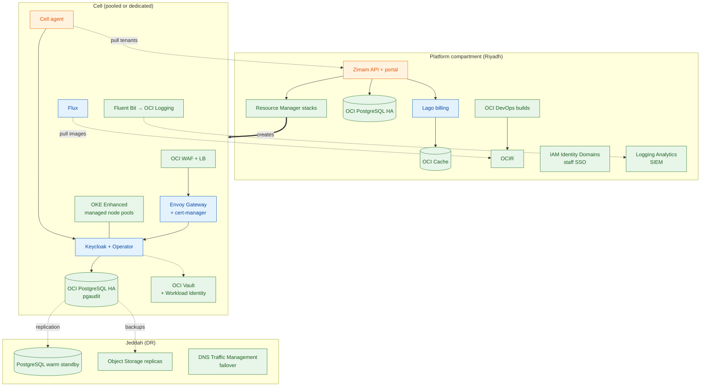

# Zimam Managed Services and Cost HLD

| | |
|---|---|
| **Product** | Zimam Identity Cloud, powered by Keycloak |
| **Scope** | Which OCI managed services Zimam uses, what it costs to run, and how Zimam prices its tiers |
| **Status** | Draft, design phase |
| **Owner** | Ahmed Assaf |
| **Last updated** | 2026-10-07 |
| **Related** | [HLD](hld.md), [Security and compliance](security-compliance.md), [Gap analysis](gap-analysis.md), [Competitor analysis](../market/ksa-competitor-analysis.md) |
| **Cost model** | [cost_model.py](cost_model.py). Every cost in sections 7 and 8 comes from this script. Change an assumption and run `python docs/architecture/cost_model.py` to refresh. |

## 1. Purpose and scope

The main [HLD](hld.md) describes what Zimam is and how it works. This document answers three follow-up questions:

1. **Managed services:** which parts of the platform should Oracle run for us, and which parts must we run ourselves? Zimam has a team of 1–3 people, so every component we operate is time not spent on the product.
2. **Cost:** what does each building block cost per month on OCI Riyadh and Jeddah, and what is the minimum monthly cost before the first customer pays?
3. **Pricing:** what should each tier cost the customer, what margin does that give, and how many customers do we need to break even?

Out of scope: staff salaries in detail, tax and accounting, and Oracle discount negotiation. Each is flagged where it matters.

## 2. Managed-first principle

**Rule:** if OCI runs a service in both Saudi regions, and that service meets the requirement, use the managed service. Run something ourselves only when one of these is true:

- OCI has no equivalent (Keycloak, billing).
- The managed service breaks a design rule. For example, a push-based deploy service would need inbound access to Gov cells.
- The managed service cannot scale to what we need. For example, OCI Load Balancer can't hold certificates for thousands of customer domains.
- The managed service costs far more than the work it saves. For example, a Network Firewall in every cell at launch.

What we save is operations work, not invoice cost: patching, high availability, backups, upgrades, scaling, and the evidence auditors ask for. OCI's managed services also inherit OCI's CST Class C status and attestations, which shortens the NCA CCC evidence pack (see [security-compliance.md](security-compliance.md)).

### 2.1 Service availability in Saudi regions

On 2026-10-07 we checked every service in this document against its live regional API endpoint in **Riyadh (me-riyadh-1)** and **Jeddah (me-jeddah-1)**. All of them answer in both regions. This settles most of [HLD risk 1](hld.md#11-risks-and-open-questions). Three design facts came out of the check:

- **Each region has one availability domain.** In-region high availability spreads across three fault domains, which protects against hardware and rack failures but not against losing a data center. Real disaster recovery therefore uses both regions, which is already the design.
- **PostgreSQL cross-region DR uses "Replication with Warm Standby"** (PostgreSQL 14+, manual failover, RPO limit configurable from 5 minutes to 3 hours). Cross-region *backup copy* is not supported for regional-data-placement systems, so confirm the placement type in the first spike.
- **`pgaudit` is supported** on OCI Database with PostgreSQL. It must be enabled in the configuration. This answers the audit-log requirement for CCC 2-11.

Still to confirm in the console: compute shape capacity (E5/E6, Ampere A1), the virtual private vault limit (0 by default, so raise a limit request), and the Dedicated KMS limit.

## 3. Managed service map

**Legend:** **OCI** = OCI managed service. **OSS** = open source we run on OKE. **Build** = we write it. **Changed** = differs from the original HLD.

### 3.1 Compute, provisioning and delivery

| Need | Choice | Type | Why | Notes |
|---|---|---|---|---|
| Kubernetes | **OKE Enhanced clusters** for production; **Basic** (free) for staging and DR standby | OCI | Managed control plane, managed add-ons, workload identity, automatic node cycling for upgrades | **Changed:** cluster type is now specified. Enhanced costs USD 73 per cluster per month. |
| Worker nodes | **Managed node pools**, E5 Flex; consider Ampere A1 for Keycloak pools after load tests | OCI | Virtual nodes don't run DaemonSets, which would break Fluent Bit, Falco and Kyverno in the cells | See saving lever 2 in section 10 |
| Cluster add-ons | **OKE add-ons**: Cluster Autoscaler, Metrics Server, cert-manager | OCI | Oracle installs and upgrades them | Customer custom-domain certificates still use cert-manager (section 4) |
| Pod access to OCI APIs | **OKE Workload Identity** | OCI | Pods get short-lived tokens to Vault, Object Storage and Streaming. No API keys stored in the cluster. | **Changed:** new. Needs Enhanced clusters. |
| Cell provisioning | **OCI Resource Manager** stacks (section 5) | OCI + Build | Managed Terraform state, locking, plan and apply history, drift detection. Jobs run inside OCI Riyadh. | We build only the Terraform modules and the API calls |
| Foundation | **OCI Core Landing Zone** as a Resource Manager stack | OCI | CIS-aligned compartments, IAM, Cloud Guard and Security Zones from day one | |
| Image build, scan, sign | **OCI DevOps build pipelines** → OCIR | OCI | Builds and signing happen in the Kingdom; the service itself is free, only runner compute is billed | **Changed:** new. Code can stay on GitHub. |
| Image registry | **OCIR** | OCI | Billed at the Object Storage rate | |
| Rollout to cells | **Flux** (pull) | OSS | OCI DevOps deploy pipelines push into clusters, which would need inbound access to Gov cells | Keep |
| Provisioning job queue | **OCI Queue** (optional) | OCI | Retries and dead-letter handling for tenant and cell jobs without building them | **Changed:** new, optional |

### 3.2 Data

| Need | Choice | Type | Why | Notes |
|---|---|---|---|---|
| Keycloak and control-plane databases | **OCI Database with PostgreSQL**: HA across fault domains, automatic backups, pgaudit | OCI | Patching, failover, backups and point-in-time restore are Oracle's job | Largest single cost line (section 7) |
| Cross-region DR database | **PostgreSQL Replication with Warm Standby** to Jeddah | OCI | Managed replica with a configurable RPO | Manual failover, runbook required |
| Cache for Lago | **OCI Cache** (Redis/Valkey) | OCI | Lago needs Redis; OCI runs it | **Changed:** new |
| Keycloak cache | Embedded Infinispan | OSS | Keycloak doesn't support Redis; this is part of Keycloak | Keep |
| Backups, log archive | **Object Storage** with retention rules (locked) and cross-region replication to Jeddah | OCI | Immutable, cheap, native replication | |
| Database activity monitoring (Gov) | **Data Safe** | OCI | Included at no cost for OCI cloud databases | **Changed:** new, Gov tier option |

### 3.3 Network and edge

| Need | Choice | Type | Why | Notes |
|---|---|---|---|---|
| Layer 7 protection | **OCI WAF** per cell | OCI | Managed rules, bot and rate controls | First instance free, then USD 5 a month |
| Load balancing | **OCI Flexible Load Balancer** in front of each cell | OCI | Managed, HA | |
| Routing by hostname, customer domains | **Envoy Gateway** + **cert-manager** | OSS | OCI LB has limits on certificates and hostnames per load balancer; Zimam needs thousands of customer domains | Keep |
| Zimam's own certificates (portal, API) | **OCI Certificates** | OCI | Free, managed renewal, tied to the load balancer | **Changed:** new |
| DNS and DR failover | **OCI DNS** + **Traffic Management steering** with health checks | OCI | Riyadh-to-Jeddah failover becomes a policy instead of a manual DNS change | **Changed:** new |
| Private connectivity (Gov) | **FastConnect** (Riyadh: Center3/Mobily; Jeddah: Mobily, stc) and Site-to-Site VPN (free) | OCI | | |
| Management network segmentation | NSGs + **Zero Trust Packet Routing** (free) at launch; **Network Firewall** per Gov cell or in a shared hub | OCI | Network Firewall costs USD 2,008 a month per instance, so add it when a Gov customer requires it | **Changed:** phased (section 10) |

### 3.4 Security, keys and identity

| Need | Choice | Type | Why | Notes |
|---|---|---|---|---|
| Keys and secrets, pooled cells | **OCI Vault default vault** with HSM-protected keys + **External Secrets Operator** | OCI | First 20 HSM key versions free; secrets free | **Changed:** default vault, not a private vault, for pooled cells |
| Keys, Gov customers | **Virtual private vault** (USD 2,719 a month), **External KMS** for BYOK (USD 3 per key version a month), or **Dedicated KMS** | OCI | The customer chooses: their own HSM partition, or keys held in their own HSM | Sold as Gov options (section 8) |
| Staff SSO, OCI console access | **OCI IAM Identity Domains** with MFA | OCI | **Changed:** breaks a circular dependency. If a Keycloak cell is down, staff must still be able to log in to fix it. | Zimam's own Keycloak stays for the customer portal |
| Privileged access | **OCI Bastion** (free), time-limited sessions | OCI | | |
| Posture and threats | **Cloud Guard**, **Security Zones**, **Vulnerability Scanning** (all free) | OCI | | |
| SIEM | **OCI Logging Analytics** | OCI | Available in both regions, so the Wazuh fallback is no longer needed. Running Wazuh is a significant job for a small team. | **Changed:** decision made |
| Runtime and admission policy | Falco, Kyverno | OSS | No OCI equivalent inside Kubernetes | Keep |

### 3.5 Observability and operations

| Need | Choice | Type | Why | Notes |
|---|---|---|---|---|
| Logs | **Fluent Bit → OCI Logging** → Logging Analytics | OCI + OSS | | |
| Keycloak and application metrics | Prometheus + Grafana in each cell | OSS | Keycloak exposes Prometheus metrics; per-tenant labels | Keep |
| Infrastructure alarms | **OCI Monitoring alarms + Notifications** | OCI | No alerting HA to run ourselves | **Changed:** new |
| Synthetic login probes | Self-run probe (k6 or blackbox) in each cell, plus **OCI Health Checks** for public endpoints | OSS + OCI | APM synthetic monitoring costs about USD 88 a month per probe running every minute; a self-run probe is nearly free | |
| Customer event export | **OCI Streaming** | OCI | | |
| Transactional email | **OCI Email Delivery** | OCI | USD 0.085 per 1,000 emails | |
| SMS OTP | Unifonic | Partner | Branded OTP in KSA; OCI's SMS zone for Saudi Arabia isn't published | Keep, pass the cost through |
| Cost tracking | **OCI Budgets**, cost-tracking tags, Cost Analysis | OCI | Per-cell and per-tenant unit cost (gap analysis 2.7) | |

### 3.6 Stays self-run (and why)

| Component | Why there is no managed option |
|---|---|
| Keycloak + Keycloak Operator | OCI has no managed Keycloak. OCI IAM Identity Domains competes with Zimam; it isn't something to build on. |
| Envoy Gateway + cert-manager | Customer custom domains at scale (section 3.3) |
| Flux | Pull-only delivery to cells, no inbound access |
| Lago + ZATCA connector | No OCI billing or e-invoicing service |
| Cell agent, Zimam API, portal | Our product |
| Prometheus, Grafana, Falco, Kyverno | Kubernetes-level tools with no OCI equivalent |

## 4. Architecture: managed vs self-run



Green is OCI managed, blue is open source we run, orange is what we build.

## 5. Resource Manager stacks: how provisioning works

A Resource Manager **stack** is a Terraform configuration with its variables and state, managed by OCI. Zimam uses three kinds:

| Stack | Count | Created by | Contents |
|---|---|---|---|
| Landing zone | 1 per environment | Ops team, once | OCI Core Landing Zone: compartments, IAM, Cloud Guard, Security Zones, logging, Vault |
| Platform | 1 per environment | Ops team, Git pipeline | Control-plane OKE, PostgreSQL, Cache, LB, WAF, DNS |
| Cell | 1 per cell | **Zimam API** through the Resource Manager API | Modules `network`, `oke-cell`, `postgres`, `vault`, `edge`, `dr`. Pooled and dedicated cells differ only in variables. |

All cells share the same module version from OCI DevOps or Git. Upgrading a module means rolling a new version out stack by stack, pooled cells first.

```mermaid
sequenceDiagram
    autonumber
    participant S as Sales / Zimam API
    participant RM as OCI Resource Manager
    participant OCI as OCI services
    participant AG as Cell agent
    S->>RM: Create stack (cell modules, variables: size, tier, compartment)
    S->>RM: Create plan job
    RM-->>S: Plan output
    S->>S: Policy checks (Checkov, OPA); approval for Gov
    S->>RM: Create apply job
    RM->>OCI: Compartment, VCN, OKE, PostgreSQL, Vault, WAF, LB
    RM-->>S: Job succeeded, outputs (cluster ID, endpoints)
    Note over OCI,AG: Flux bootstraps the cell, cell agent starts
    AG->>S: Register cell, report Ready
    S->>S: Cell available for placement
```

What we get without building it: state storage and locking, an audit trail of every job (who, when, what changed), drift detection on a schedule, and private endpoints so jobs can reach private clusters. What we still build: the modules, the API calls above, and a nightly drift check that opens an alert.

## 6. Cost model assumptions

- **Prices:** OCI pay-as-you-go USD list prices from Oracle's public price API, retrieved 2026-10-07. OCI charges the same price in every commercial region, including Riyadh and Jeddah. No Universal Credits discount is applied.
- **Currency:** USD 1 = SAR 3.75. Prices exclude 15% VAT.
- **Month:** 730 hours. Free tiers are ignored, so the totals are slightly high.
- **Compute:** E5 Flex, where 1 OCPU = 2 vCPU. USD 0.03 per OCPU-hour and USD 0.002 per GB-hour.
- **Keycloak sizing** (keycloak.org HA guide): about 1,250 MB per pod; 1 vCPU per 15 password logins per second, per 120 client-credential grants per second, and per 120 refresh-token requests per second; 150% CPU headroom. Database: 0.35–0.7 vCPU per 100 logins/refreshes per second.
- **Pooled cell capacity:** 200 Starter realms and 40 Business instances. The shared cell base is split 50/50 between the two. Load tests will set the real limits ([HLD risk 4](hld.md#11-risks-and-open-questions)).
- **PostgreSQL (two assumptions to confirm with Oracle):** Oracle publishes USD 0.098 per OCPU-hour and USD 0.072 per GB-month of storage, but no memory price. The model charges memory at the E5 compute rate and bills compute and memory **per node** (primary and replica). If Oracle bills HA differently, PostgreSQL costs, the largest line, change.

### 6.1 Key unit prices

| Service | Price (USD) | Unit |
|---|---|---|
| OKE Enhanced cluster | 0.10 | cluster-hour (Basic is free) |
| Compute E5 Flex | 0.03 / 0.002 | OCPU-hour / GB-hour |
| Ampere A1 | 0.01 / 0.0015 | OCPU-hour / GB-hour (first 3,000 OCPU-h and 18,000 GB-h free each month) |
| OCI Database with PostgreSQL | 0.098 + 0.072 | OCPU-hour + storage GB-month |
| Block Volume (balanced) | 0.0425 | GB-month |
| Object Storage, standard / archive | 0.0255 / 0.0026 | GB-month |
| Flexible Load Balancer | 0.0113 + 0.0001 | hour + Mbps-hour |
| WAF | 5 + 0.60 | instance-month + million requests (first 10M free) |
| Vault: virtual private vault | 3.724 | hour (USD 2,719 a month) |
| Vault: HSM key versions | 0.5334 | key version-month (first 20 free) |
| Network Firewall | 2.75 | hour (USD 2,008 a month) |
| Logging Analytics | 372 | 300 GB active storage unit-month |
| OCI Cache | 0.0194 | GB-hour |
| FastConnect 1 Gbps | 0.2125 | port-hour |
| Outbound data, Middle East | 0.05 | GB after the first 10 TB a month |
| Email Delivery | 0.085 | 1,000 emails |
| Bastion, Cloud Guard, Security Zones, Vulnerability Scanning, Certificates, Resource Manager, DevOps service, Secrets, ZPR | Free | — |

## 7. Infrastructure cost by building block

All figures are monthly, in USD, from `cost_model.py`.

### 7.1 Platform (control plane, production)

| Item | USD |
|---|---|
| OKE Enhanced cluster | 73 |
| 3 nodes E5 2 OCPU / 16 GB (API, portal, Lago, Flux sources) | 208 |
| Control-plane PostgreSQL HA, 2 OCPU / 16 GB x2, 100 GB | 343 |
| OCI Cache for Lago, 2 GB x2 nodes | 57 |
| Load balancer + WAF | 21 |
| Logging Analytics (SIEM), 1 unit | 372 |
| Logging, Object Storage (1 TB standard + 5 TB archive), OCIR | 43 |
| DNS + Traffic Management steering | 57 |
| DevOps build runners | 6 |
| Jeddah cross-region backup copies | 26 |
| Monitoring, Notifications, email | 15 |
| **Total** | **1,219 (SAR 4,572)** |

Staging (OKE Basic, 2 nodes, single-node PostgreSQL, small LB): **USD 273 (SAR 1,024)**.

### 7.2 Pooled cell (Starter + Business), fixed base

| Item | USD |
|---|---|
| OKE Enhanced cluster | 73 |
| System pool 3 x E5 2 OCPU / 16 GB (Envoy, Flux, agent, Prometheus, Fluent Bit, Falco, Kyverno) | 208 |
| Starter pool 3 x E5 2 OCPU / 16 GB (shared Keycloak, 3 pods) | 208 |
| Cell PostgreSQL HA, 4 OCPU / 64 GB x2, 500 GB | 808 |
| Load balancer 200 Mbps + WAF 100M requests | 82 |
| Prometheus volumes, logging, Object Storage + Jeddah copy | 39 |
| SIEM share (0.5 Logging Analytics unit) | 186 |
| DNS, Monitoring, email | 25 |
| **Total** | **1,629 (SAR 6,107)** |

PostgreSQL is half of the cell base. It is the first line to right-size after load tests.

### 7.3 Business tenant (added to a pooled cell)

Each Business instance runs its own Keycloak pods (namespace, quota) and has its own database on the cell's PostgreSQL. Node packing overhead is 25%. Each tenant also carries a USD 17.76 share of the pooled cell base.

| Size | Keycloak | Typical load | Direct cost USD | Jeddah DR standby USD |
|---|---|---|---|---|
| Business S | 2 pods x 1 vCPU / 2 GB | Up to ~10 password logins/s | 88 | 42 |
| Business M | 2 pods x 2 vCPU / 4 GB | Up to ~25 logins/s | 177 | 85 |
| Business L | 3 pods x 4 vCPU / 6 GB | Up to ~75 logins/s | 412 | 165 |

The login rates already include the 150% headroom from the Keycloak sizing guide. Token refresh and client-credential traffic is about 8 times cheaper per request.

### 7.4 Dedicated cell (Enterprise / Gov)

| Size | Cell (Riyadh) | DR warm standby (Jeddah) | Total USD | Total SAR |
|---|---|---|---|---|
| **S**: 3 x E5 2/16 shared nodes, PostgreSQL 2 OCPU HA | 933 | 298 | **1,230** | **4,613** |
| **M**: Keycloak pool 3 x E5 4/32, PostgreSQL 4 OCPU HA | 2,005 | 587 | **2,593** | **9,723** |
| **L**: Keycloak pool 3 x E5 8/64, PostgreSQL 8 OCPU HA | 3,773 | 1,301 | **5,074** | **19,029** |

The DR standby runs a free OKE Basic cluster with small nodes that scale up on failover, plus a single-node PostgreSQL warm-standby replica.

### 7.5 Gov options (per dedicated cell)

| Option | USD | SAR | Cheaper alternative |
|---|---|---|---|
| Virtual private vault (own HSM partition) | 2,719 | 10,194 | **External KMS (BYOK)** at USD 3 per key version, if the customer has its own HSM |
| Network Firewall | 2,008 | 7,528 | **One shared hub firewall** for all Gov cells through a DRG, cost split across customers |
| FastConnect 1 Gbps | 155 | 582 | Site-to-Site VPN (free) |
| **All three** | **4,881** | **18,304** | |

The Gov options cost more than a whole Enterprise S cell. They must be priced separately, never bundled into the base Enterprise price.

### 7.6 Minimum monthly cost at launch

| Phase | What's included | SAR / month |
|---|---|---|
| **Infrastructure** | Platform + staging + one pooled cell | **11,703** |
| Pentest, twice a year (CCC 2-10) | Placeholder: SAR 60k each | 10,000 |
| ISO 27001 certification + audits | Placeholder: SAR 90k a year | 7,500 |
| ZATCA e-invoicing provider, insurance, tools | Placeholders | 4,000 |
| **Phase 1: launch (Starter + Business)** | | **33,203** |
| MSSP 24/7 SOC | Placeholder, added when the first Enterprise/Gov contract is signed | 25,000 |
| **Phase 2: with Enterprise / Gov** | | **58,203** |

Third-party figures are placeholders for planning only. Replace them with quotes. Salaries are excluded (section 9).

## 8. Pricing

### 8.1 Principles

From the [competitor analysis](../market/ksa-competitor-analysis.md#pricing-principles), plus cost findings from this document:

1. **Publish prices in SAR**, excluding VAT. Annual prepay gets a 10% discount.
2. **Starter is priced per MAU band. Business and Enterprise are priced per instance**, with unlimited users within the capacity of the size. This is predictable for the customer and matches what Zimam actually pays for (CPU and memory, not users).
3. **Pass-through costs stay outside the plan price.** SMS OTP, Nafath and Yakeen (customer's own Elm credentials) and FastConnect cross-connects are billed at cost plus 10%.
4. **Gov options are priced separately** (section 7.5) because they cost more than the cell itself.
5. **Target gross margin on infrastructure:** at least 70% on pooled tiers and at least 55% on dedicated cells. Dedicated cells carry fixed single-tenant cost, as with Phase Two and Cloud-IAM.

### 8.2 Price book (SAR per month, excluding VAT)

| Plan | Includes | Price | Infra cost | Margin |
|---|---|---|---|---|
| **Free** | 1 realm, 1,000 MAU, Zimam subdomain, community support | 0 | ~17 | — |
| **Starter 5k** | 5,000 MAU, 1 realm, themes, email support | 290 | 17 | 94% |
| **Starter 10k** | 10,000 MAU | 490 | 26 | 95% |
| **Starter 25k** | 25,000 MAU | 990 | 52 | 95% |
| **Starter 50k** | 50,000 MAU; above this, move to Business | 1,690 | 86 | 95% |
| **Business S** | Own Keycloak instance and database, full admin console, reviewed SPIs, custom domain, Nafath connector | 1,500 | 397 | 74% |
| **Business M** | As S, more capacity | 3,000 | 729 | 76% |
| **Business L** | As S, 3 pods | 6,000 | 1,611 | 73% |
| **Enterprise S** | Dedicated cell, Jeddah DR included, 24/7 support, pinned version, own maintenance window | 11,250 | 4,613 | 59% |
| **Enterprise M** | As S, larger | 24,000 | 9,723 | 59% |
| **Enterprise L** | As S, larger | 45,000 | 19,029 | 58% |

### 8.3 Add-ons

| Add-on | For | Price SAR / month | Infra cost SAR | Margin |
|---|---|---|---|---|
| DR warm standby, Business S / M / L | Business | 500 / 1,000 / 2,000 | 158 / 317 / 621 | 68–69% |
| Dedicated HSM vault | Gov | 13,500 | 10,194 | 24% |
| BYOK via External KMS | Enterprise / Gov | 500 | ~11 | — |
| Dedicated Network Firewall | Gov | 10,000 | 7,528 | 25% |
| Shared hub firewall | Gov | 2,500 | Split across Gov cells | — |
| FastConnect 1 Gbps port | Enterprise / Gov | 1,500 + partner fees at cost | 582 | 61% |
| Extra environment (non-prod Business S, no HA) | Business | 600 | ~190 | ~68% |
| Custom domain | Starter | 75 | ~0 | — |
| Nafath connector | Starter (included in Business and Enterprise) | 250 | ~0 | — |
| Event / SIEM export stream | Business (included in Enterprise) | 400 | ~20 | — |
| Premium support 24/7, 1 h response | Business | 20% of subscription, minimum 1,500 | Staff time | — |
| SMS OTP, Nafath/Yakeen fees | All | At cost + 10% | Pass-through | — |

The two Gov security add-ons run at low margin on purpose: they are mostly Oracle pass-through. The Enterprise contract carries the margin. Where possible, steer customers to the cheaper option (BYOK, shared hub firewall).

### 8.4 Competitive check

| Usage | Zimam | Market anchors (from the competitor analysis) |
|---|---|---|
| 10k MAU | Starter 10k: **SAR 490** | OCI IAM External User about SAR 600; Yookey about SAR 1,680; Auth0 about SAR 2,625; Entra and Cognito free (no KSA residency) |
| Small dedicated Keycloak | Business S/M: **SAR 1,500 / 3,000** | Skycloak USD 149–599 (SAR 560–2,250); Phase Two USD 749–999 (SAR 2,800–3,750); Cloud-IAM €495 (about SAR 2,130) |
| Enterprise entry | Enterprise S: **SAR 11,250** (SAR 121,500 a year with annual prepay) | Ping PingOne for Customers Essential USD 35k a year (SAR 131,250); in-Kingdom only via Dammam, sales-led |

Starter sits just below OCI IAM's list price for in-Kingdom identity. Business sits in the middle of the managed-Keycloak specialists while adding KSA residency and Nafath. Enterprise S with annual prepay comes in below Ping's entry price and includes a dedicated cell and DR. A lower Enterprise price needs the saving levers in section 10.

### 8.5 Quotas and overage

- **Starter:** MAU is counted per calendar month by the metering event listener. The customer is warned at 80% and 100%. Above 100%, logins keep working and the customer moves to the next band the following month (soft limit). The Free tier is a hard limit: new users beyond 1,000 MAU are blocked, and existing users still log in.
- **Business and Enterprise:** no user limit. When sustained CPU stays above 70% for 7 days, Zimam recommends the next size. Edge rate limits protect the cell.
- **Free tier cost control:** each free realm costs about SAR 17 a month. Free realms are capped at 100 per pooled cell, and a realm with no logins for 30 days is suspended.

## 9. Break-even

Contribution per customer = price − infrastructure cost (section 8.2).

| Phase | Monthly fixed cost (SAR) | Example customer mix that covers it | Contribution (SAR) |
|---|---|---|---|
| 1. Launch, no salaries | 33,203 | 10 Business M + 25 Starter 10k | 34,310 |
| 2. With MSSP SOC, no salaries | 58,203 | Phase 1 mix + 4 Enterprise S | 60,858 |
| 3. With a team of 3 (placeholder SAR 30k each, fully loaded) | 148,203 | Phase 2 mix + 2 Enterprise M + 20 Business M + 30 Starter 10k | 148,752 |

Takeaways:

- **Business is the volume engine.** Each Business M contributes about SAR 2,270 a month, and 10 of them plus some Starter accounts cover launch costs.
- **Enterprise covers the MSSP.** Do not sign the MSSP until the first Enterprise or Gov contract is signed, because the SOC alone costs almost as much as four Enterprise S contributions.
- **Starter contributes little in absolute terms** despite its 95% margin. Its job is the sales funnel into Business.

## 10. Saving levers

| # | Lever | Effect | When |
|---|---|---|---|
| 1 | **Universal Credits annual commit** with Oracle, plus Support Rewards if eligible | Negotiated discount on every line (Oracle publishes no schedule) | Once monthly spend is predictable, about 6 months after launch |
| 2 | **Ampere A1 for Keycloak node pools** | About 30% cheaper per vCPU than E5, and the first 4 OCPU / 24 GB each month are free. Validate password-hashing throughput in the load tests. | After load tests |
| 3 | **Right-size PostgreSQL** | PostgreSQL is about 50% of a pooled cell base and 43% of an Enterprise S cell. The Keycloak guide suggests 2 OCPU handles about 300 logins/s. | After load tests |
| 4 | **Archive logs after 90 days** | Logging Analytics archival costs USD 14.6 per unit a month, against USD 372 for active storage | At launch |
| 5 | **Shared hub Network Firewall** for Gov cells | One USD 2,008 firewall shared across all Gov cells instead of one per cell | First Gov customer |
| 6 | **BYOK through External KMS** instead of a virtual private vault | USD 3 per key version against USD 2,719 a month | Gov sales conversations |
| 7 | **OKE Basic** for staging and DR standby | Saves USD 73 per cluster | At launch (already in the model) |
| 8 | **Watch egress** | Middle East egress costs USD 0.05 per GB after 10 TB, about 6 times the US/EU rate. Identity traffic is small, but bulk exports and log forwarding count. | Budgets and alerts at launch |
| 9 | **Budgets and cost tags per compartment, cell and tenant** | Monthly unit-cost report (cost per MAU, per instance, per cell) feeds back into this model | At launch |

## 11. Risks and open questions

| # | Item | Impact | Next step |
|---|---|---|---|
| 1 | PostgreSQL memory price and HA billing aren't published | Largest cost line could be over- or under-estimated | Run the OCI Cost Estimator and ask Oracle sales; update `PG_GB_H` and the `pg()` function |
| 2 | One availability domain per region | Fault domains don't protect against losing a data center | Keep cross-region DR; state the fault-domain design in the SLA |
| 3 | PostgreSQL cross-region backup copy not supported for regional-data-placement systems | DR plan for Starter (restore from Jeddah backups) may need warm standby or a logical backup instead | Confirm placement type in the first spike |
| 4 | Virtual private vault limit is 0 by default | Gov onboarding blocked until raised | Raise service limits in both regions early |
| 5 | Shape capacity for E5/E6/A1 in Riyadh and Jeddah | Cells can't scale | Confirm in the console; request limits |
| 6 | Saudi Arabia's SMS price zone isn't published | Unknown cost if OCI Notifications SMS were used | Keep Unifonic and pass the cost through |
| 7 | Third-party costs are placeholders | Break-even points may move a lot | Get quotes: MSSP, pentest firm, ISO certification body, ZATCA provider, insurer |
| 8 | Pooled cell limits (200 realms, 40 Business instances) are guesses | Starter and Business unit costs depend on them | Load tests ([gap analysis 2.1](gap-analysis.md)) |
| 9 | Oracle prices and the SAR peg change | Margins drift | Re-run `cost_model.py` every quarter with the price API |
| 10 | Oracle Alloy sovereign cloud (stc) | Some Gov buyers may ask for it instead of the public Riyadh region | Track; the same Terraform modules should work on Alloy |

## 12. Decisions taken in this document

| Decision | Choice |
|---|---|
| OKE cluster type | Enhanced in production, Basic for staging and DR standby |
| SIEM | OCI Logging Analytics (Wazuh fallback dropped) |
| Staff identity | OCI IAM Identity Domains, not Zimam's own Keycloak |
| Keys in pooled cells | Default vault with HSM keys; private vault only for Gov |
| Network Firewall | Not at launch; per Gov cell or in a shared hub when sold |
| Builds | OCI DevOps build pipelines in Riyadh |
| DR failover | OCI DNS Traffic Management steering + PostgreSQL warm standby |
| Pricing model | Starter per MAU band; Business and Enterprise per instance size; Gov options and pass-through costs separate |
