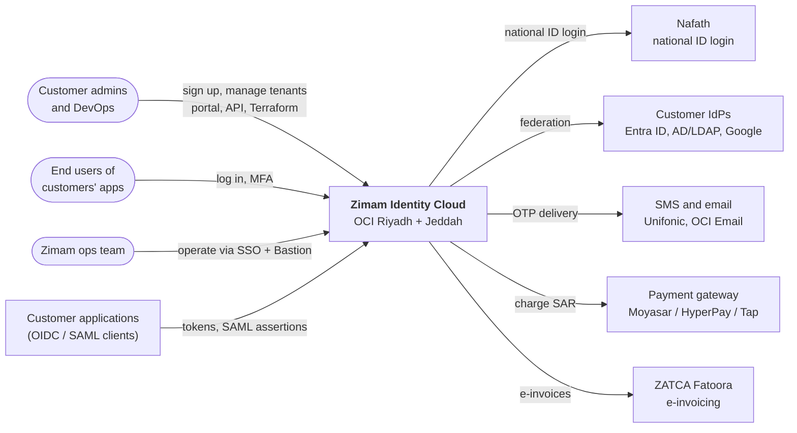
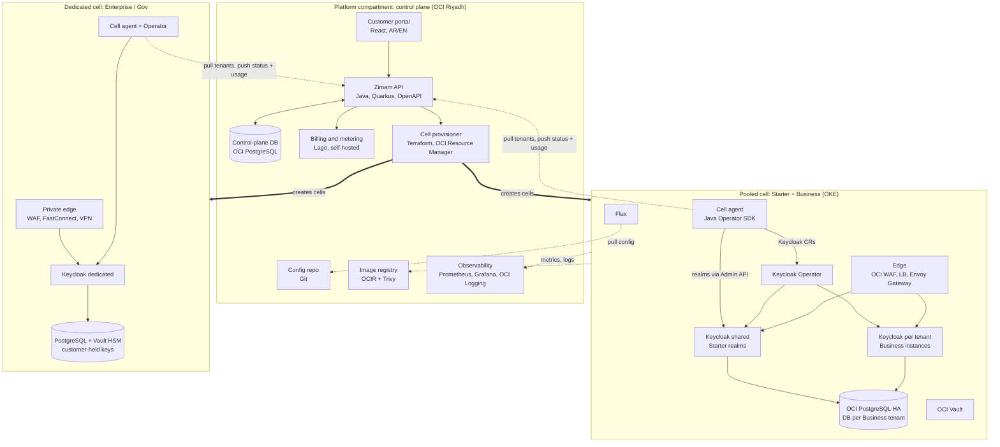
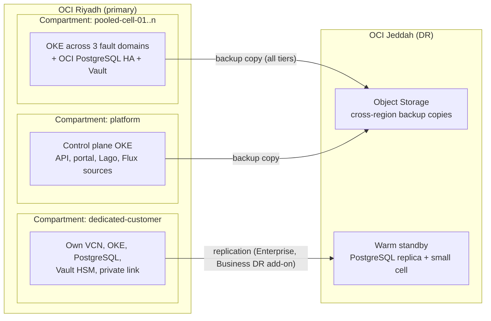
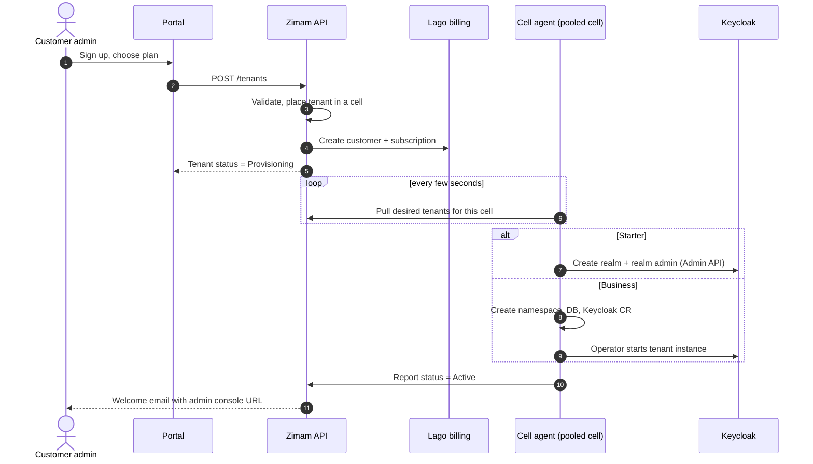
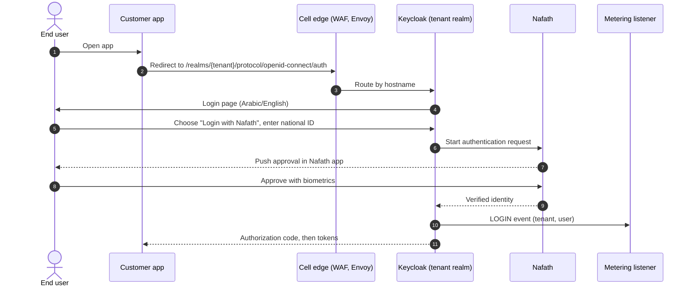
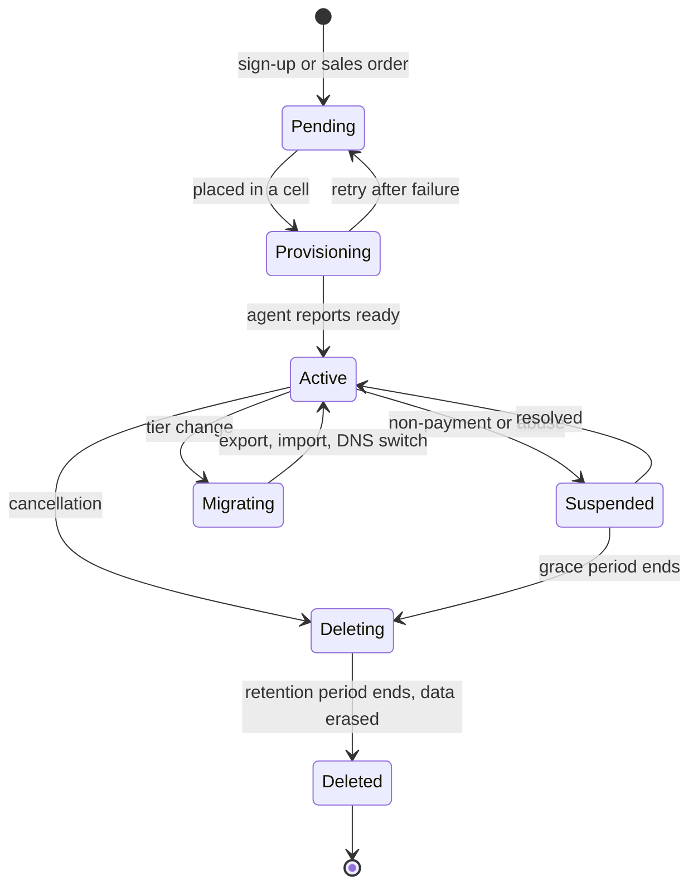

# Zimam (زمام) High-Level Design

| | |
|---|---|
| **Product** | Zimam Identity Cloud, powered by Keycloak |
| **Hosting** | Oracle Cloud Infrastructure, Saudi regions: Riyadh (primary), Jeddah (DR) |
| **Status** | Draft, design phase |
| **Owner** | Ahmed Assaf |
| **Last updated** | 2026-10-07 |
| **Visual diagram** | [zimam-components.html](zimam-components.html) (open in a browser) |
| **Managed services and costs** | [hld-managed-services-costs.md](hld-managed-services-costs.md) |

## 1. Purpose and scope

Zimam is a managed identity and access management service for Saudi organizations. It runs upstream Keycloak as a multi-tenant SaaS and keeps all customer data in the Kingdom. It also brings Saudi-specific capabilities: Nafath login, NCA and PDPL compliance evidence, Arabic login pages, and SAR billing with ZATCA e-invoicing.

This document covers the first release (MVP): three commercial tiers on one platform. Later modules are listed in section 12 but not designed here: identity verification, risk scoring, no-code journeys, fine-grained authorization and identity governance.

## 2. Product tiers

| Tier | Isolation | Customer gets | Customization | Pricing basis |
|---|---|---|---|---|
| **Starter** | Realm in a shared Keycloak (pooled cell) | Self-serve sign-up, realm admin console | Themes only, no custom code | Per MAU band, free tier |
| **Business** | Own Keycloak instance and database (pooled cell) | Full admin console | Themes + reviewed custom extensions (SPIs) | Per instance size, unlimited users |
| **Enterprise / Gov** | Dedicated cell in its own OCI compartment | Full admin console, private connectivity | Any extension, pinned version, own maintenance window | Per cell size + contract |

Pricing is configured per plan in the billing catalogue (MAU, total users, instance size, add-ons). The platform supports every model, so commercial changes don't need code changes.

## 3. System context

## 4. Logical architecture

The platform uses a **cell-based architecture**. A cell is a complete Keycloak stack: a Kubernetes cluster, PostgreSQL, Vault keys and an edge. One control plane manages all cells, and a tier is only a placement decision.

### 4.1 Components

| Component | Responsibility | Technology | Build or use |
|---|---|---|---|
| Customer portal | Sign-up, plans, tenants, custom domains, users of the portal | React, Arabic + English (RTL) | Build |
| Zimam API | Single source of truth for tenants, plans, domains, add-ons; public REST API | Java 21, Quarkus, OpenAPI | Build |
| Placement service | Chooses a cell for a new tenant by tier, region and capacity | Part of Zimam API | Build |
| Control-plane DB | Tenants, plans, jobs, audit trail | OCI Database with PostgreSQL | Use (managed) |
| Billing and metering | Plans, usage-based charges, invoices | Lago (self-hosted in KSA) | Use (open source) |
| Cell provisioner | Creates and updates cells from Terraform modules | Terraform via OCI Resource Manager | Build modules |
| Cell agent | Pulls desired tenants, reconciles realms, instances and databases, reports status and usage | Java Operator SDK | Build |
| Keycloak Operator | Deploys, scales and upgrades every Keycloak in a cell | Upstream Keycloak Operator | Use (open source) |
| Zimam Keycloak extensions | Nafath authenticator, MAU metering event listener, Arabic themes | Keycloak SPIs (Java) | Build |
| GitOps | Rolls platform components out to each cell (pull only) | Flux | Use (open source) |
| Edge | WAF, TLS, routing by hostname, custom-domain certificates | OCI WAF, OCI LB, Envoy Gateway, cert-manager | Use |
| Secrets and keys | DB credentials, signing keys, master key per cell; BYOK for Gov | OCI Vault (HSM for dedicated) | Use (managed) |
| Observability | SLA metrics, alerts, per-tenant audit log export | Prometheus, Grafana, Fluent Bit, OCI Logging | Use |
| Staff access | Staff MFA, recorded and time-limited production sessions | OCI IAM Identity Domains (staff SSO + MFA), OCI Bastion | Use (managed) |
| SIEM | Central security event analysis, detections, immutable archive | OCI Logging Analytics, Object Storage retention lock | Use (managed) |
| 24/7 SOC | Continuous monitoring and escalation, Saudi security staff | NCA-licensed Saudi MSSP (Zimam accountable) | Partner |
| Security posture | Misconfiguration, vulnerabilities, admission and runtime policy | Cloud Guard, Vulnerability Scanning, Kyverno, Falco | Use |
| Infrastructure as code | CIS-aligned foundation, policy checks before apply, drift detection | OCI Core Landing Zone, Terraform, Checkov, OPA | Use + build modules |

## 5. Deployment view

- **Compartments:** one per environment for the platform, one per pooled cell, one per dedicated customer. IAM policies are scoped to each compartment.
- **Network:** each cell has its own VCN with private subnets. Only the edge is public; dedicated cells can be private-only through FastConnect or IPSec VPN.
- **Availability:** OKE node pools and PostgreSQL HA are spread across the region's fault domains.

## 6. Key flows

### 6.1 Sign-up and provisioning

### 6.2 End-user login with Nafath

### 6.3 Tenant lifecycle

- **Suspended:** user logins keep working through a grace period; the admin console becomes read-only.
- **Deleting:** data is kept for 30 days by default (configurable per contract), then erased, and a deletion record is kept for PDPL evidence.
- **Migrating:** realm export and import into the new tier, then DNS switch, with a short read-only window.

## 7. Multi-tenancy and isolation

| Concern | Starter | Business | Enterprise / Gov |
|---|---|---|---|
| Compute | Shared Keycloak pods | Own pods, own namespace, NetworkPolicy, ResourceQuota | Own cluster |
| Data | Shared database, realm-scoped | Own database and credentials on the cell's PostgreSQL | Own PostgreSQL |
| Keys | Cell master key | Cell master key | Customer-held keys (Vault HSM, BYOK) |
| Network | Public edge | Public edge, optional IP allow-list | Private connectivity option |
| Admin access | Realm admin only, no master realm | Full instance admin | Full admin |
| Custom code | None | Reviewed and scanned SPI JARs | Any extension |
| Upgrades | With the shared cluster | Choose window within support policy | Pinned version, own window |

Noisy-neighbour limits on pooled cells: per-realm rate limits at the edge, a maximum number of realms per shared Keycloak (about 200, to be set by load testing), and automatic placement into a new cell when capacity is reached.

## 8. Security and compliance

- **Data residency:** all customer data, backups, logs and billing data stay in OCI Riyadh and Jeddah.
- **Encryption:** TLS 1.2+ at the edge and mTLS between cells and the control plane. Data at rest is encrypted with OCI Vault keys; dedicated cells can hold their own keys.
- **Network direction:** cells only make outbound calls to the control plane. Nothing in the platform needs inbound network access to a customer's dedicated cell.
- **Supply chain:** images and customer SPI JARs are scanned (Trivy) and signed (Cosign) before reaching a cell.
- **Staff access:** SSO with MFA, time-limited sessions through OCI Bastion, every session recorded; no standing production access.
- **Audit:** admin and login events are tagged with the tenant ID and exportable to the customer's SIEM. Every platform change goes through Git review.
- **Frameworks to evidence:** NCA ECC and CCC, PDPL (SDAIA), CST cloud regulatory framework (CSP registration), SAMA cybersecurity framework for banking customers, ISO 27001 as baseline certification.
- **Security monitoring:** platform SIEM with an immutable log archive, a 24/7 SOC through a Saudi MSSP under Zimam's accountability, and managed threat detection on every customer realm. CCC-2:2024 2-11-P-1-5 requires SIEM coverage of the full stack.
- **Data localization:** CCC-2:2024 moved localization controls to NDMO (SDAIA). Zimam still keeps everything in the Kingdom by design.
- **Details:** control-by-control mapping, SIEM design, IaC pipeline and the responsibility model are in [security-compliance.md](security-compliance.md). Operational, product and business gaps are tracked in [gap-analysis.md](gap-analysis.md).

## 9. Non-functional requirements (proposed)

| Requirement | Starter | Business | Enterprise / Gov |
|---|---|---|---|
| Availability SLA | 99.9% | 99.95% | 99.95% (99.99% with multi-site later) |
| Backups | Daily + point-in-time restore, 7 days | Daily + point-in-time restore, 14 days | Configurable |
| Disaster recovery | Restore from Jeddah backups (RTO hours) | Add-on: warm standby, RPO 15 min, RTO 1 h | Included: warm standby, RPO 15 min, RTO 1 h |
| Support | Email, business hours | Email + chat, 4 h response | 24/7, 1 h response |
| Provisioning time | Under 1 minute | Under 10 minutes | 30 to 60 minutes |

## 10. Technology decisions

| Decision | Choice | Main reason |
|---|---|---|
| Tenancy model | Cell-based: pooled + dedicated cells | One control plane serves all tiers; isolation is a placement choice |
| Provisioning | Terraform for cells, Kubernetes operator for tenants | Each tool handles what it is best at; tenants change often, cells rarely |
| Control-plane language | Java (Quarkus) | Same stack as Keycloak extensions; one language for a small team |
| GitOps | Flux inside each cell (pull) | No inbound access into cells, especially dedicated Gov cells |
| Ingress | Envoy Gateway (Gateway API) | ingress-nginx was retired in March 2026 |
| Billing | Lago, self-hosted | Usage-based pricing without custom code, data stays in KSA |
| Payments | Saudi gateway (Moyasar, HyperPay or Tap) | mada and SAR support; Stripe onboarding for Saudi entities to be confirmed |
| DR | Single primary region, Jeddah standby as tier feature | Active-active is too complex and costly for a small team at launch |

## 11. Risks and open questions

| # | Item | Mitigation or next step |
|---|---|---|
| 1 | OKE, OCI PostgreSQL and its cross-region replication may not be available in both Saudi regions | Endpoints confirmed live in both regions on 2026-10-07 ([managed services HLD](hld-managed-services-costs.md#21-service-availability-in-saudi-regions)); still confirm shape capacity, vault limits and PostgreSQL data placement |
| 2 | Nafath integration needs approval from its operator, with unknown lead time | Start the application early; ship OTP and passkeys first |
| 3 | Lago does not produce ZATCA Phase 2 invoices on its own | Choose a ZATCA connector or certified e-invoicing provider |
| 4 | Shared-realm limits per Keycloak cluster are unknown | Load test to set realm and MAU limits per pooled cell |
| 5 | Small team carrying 24/7 support for Enterprise | Partner for night coverage or limit Enterprise sales at launch |
| 6 | Keycloak trademark rules | Brand as "Zimam, powered by Keycloak"; avoid Keycloak in product names |

## 12. Roadmap modules (out of MVP scope)

1. Identity verification: Yakeen / Absher-style checks and eKYC
2. Risk-based authentication and fraud signals (Zimam Protect, see [AI strategy](../product/ai-strategy.md#5-design-zimam-protect-risk-based-authentication))
3. No-code login journey builder
4. Fine-grained authorization (for example OpenFGA)
5. Identity governance: access reviews, joiner-mover-leaver (for example midPoint)
6. Managed LDAP directory and API gateway add-ons

AI features across these modules (risk-based authentication, an admin copilot and MCP server, and identity for AI agents) are designed in the [AI strategy](../product/ai-strategy.md), together with competitor AI analysis and costs.
