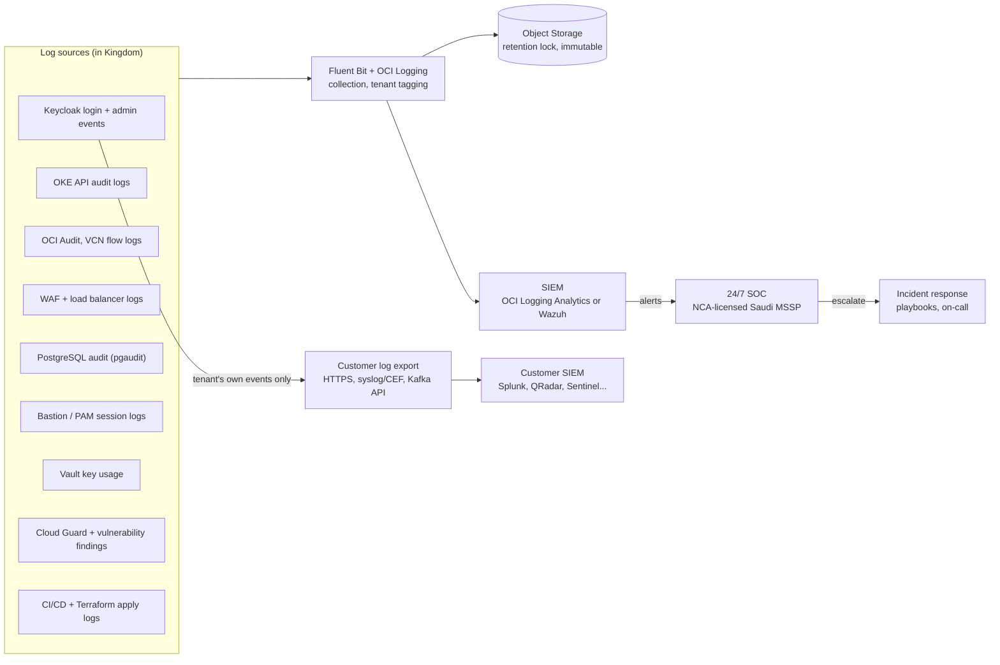
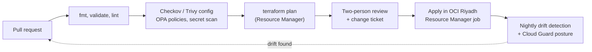

# Zimam Security, SIEM, Infrastructure as Code and Compliance (NCA, SAMA)

| | |
|---|---|
| **Status** | Draft, design phase |
| **Last updated** | 2026-10-07 |
| **Related** | [HLD](hld.md), [component diagram](zimam-components.html), [market analysis](../market/ksa-competitor-analysis.md) |

> Control IDs below for NCA CCC are taken from the official **CCC-2:2024** text published by NCA. ECC and SAMA references are by domain name only. Before any audit, confirm them against the current editions of ECC-2:2024 and the SAMA Cyber Security Framework. This document is design guidance, not legal advice.

## 1. Which frameworks apply to Zimam

| Framework | Applies to Zimam when | What it means for us |
|---|---|---|
| **NCA ECC** (Essential Cybersecurity Controls) | Always for government and CNI customers; CCC builds on ECC | Baseline controls: governance, defense, resilience, third-party |
| **NCA CCC-2:2024** (Cloud Cybersecurity Controls) | We serve a government entity or a CNI operator (the controls apply to CSPs serving those tenants) | CSP-side controls (`x-x-P-x`) apply to Zimam; tenant-side controls (`x-x-T-x`) apply to our customers, and we must make them possible |
| **SAMA Cyber Security Framework** + SAMA cloud and outsourcing rules | A bank or other SAMA-regulated customer uses Zimam | Not applied to us directly. The bank must flow its requirements down to us by contract, and may need SAMA notification or non-objection for material outsourcing. |
| **PDPL** (SDAIA) + **NDMO** data management and localization rules | Always (personal data of Saudi residents) | Lawful processing, breach notification, transfer rules. Data localization is now governed by NDMO, not CCC (see 1.1). |
| **CST cloud computing regulatory framework** | Offering cloud services in KSA | Possible CSP registration or classification; legal check required |
| **NCA NCS-1:2020** (National Cryptographic Standards) | Required by CCC 2-7-P-1-1 | Use algorithms at the "advanced" level |

### 1.1 Data localization moved out of CCC

CCC-2:2024 Annex D deleted the CCC-1:2020 subcontrols 2-3-P-1-10 and 2-3-P-1-11 ("provide cloud computing services from within the Kingdom", covering storage, processing, DR, monitoring and support). Localization controls moved to the **National Data Management Office (NDMO)** at SDAIA. Entities must consult NDMO on localization before acting.

**Design decision unchanged:** Zimam keeps all customer data, backups, logs, monitoring and support tooling in the Kingdom. Government and bank buyers still expect it, and it remains our main differentiator. The compliance argument now rests on NDMO, PDPL and sector rules (SAMA), not on CCC.

## 2. SIEM and security monitoring

CCC-2:2024 requires continuous monitoring with SIEM across the full Cloud Technology Stack (2-11-P-1-5). It also requires logging of login attempts, remote access sessions and every CSP action at the tenant level (2-11-P-1-2, -3, -7), with logs protected from alteration (2-11-P-1-4).

Zimam needs **two separate things**:

1. **Zimam's own SIEM and SOC**, watching the platform.
2. **Customer log export**, so each customer can feed its own SIEM. This is a CCC tenant control (2-11-T-1) that customers will ask us to support.

### 2.1 Architecture



### 2.2 Choices

| Need | Recommendation | Why | Alternative |
|---|---|---|---|
| Collection | Fluent Bit in every cell, OCI Logging service | Native and cheap; tags every record with tenant and cell | Vector |
| Immutable archive | OCI Object Storage with retention rules (locked) | Meets "protect logs from alteration" (2-11-P-1-4); cheap long-term storage | — |
| SIEM | **OCI Logging Analytics** if available in the Saudi regions; otherwise **Wazuh** self-hosted in Riyadh | Both keep log data in the Kingdom. Logging Analytics is managed (less work for a small team). Wazuh is open source with file-integrity and host detection. | Splunk or QRadar self-hosted (costly) |
| 24/7 SOC | **NCA-licensed Saudi MSSP** watching our SIEM | A 1–3 person team cannot staff 24/7 monitoring. CCC 1-4-P-1-1 requires Saudi nationals in cybersecurity functions in CSP data centers in the Kingdom; an MSSP covers this. | In-house SOC once the team grows |
| Customer export | Keycloak event listener SPI → OCI Streaming (Kafka-compatible) → per-tenant HTTPS / syslog-CEF push | Customers get only their own realm's events, near real time | Pull API with pagination |
| Threat intelligence | Subscribe to NCA alerts and sector CERT feeds; OCI Threat Intelligence | 2-12-P-1-1 requires subscribing to authorized threat-information sources | — |

### 2.3 First detection rules

- Brute-force and password spraying per realm (failed-login thresholds, 2-2-P-1-4)
- Admin role grants, new realm admins, client secret changes
- Login from unusual country or impossible travel for privileged users
- Token-endpoint abuse (client-credentials bursts) and refresh-token reuse
- Kubernetes: exec into Keycloak pods, privileged pods, ClusterRole changes
- Staff access outside an approved change or incident ticket
- Vault: key disable, key export, unusual decrypt volume
- WAF: spikes in blocked requests per tenant domain (DDoS signal, 2-4-P-1-3)

### 2.4 Retention (proposed)

| Log type | Searchable in SIEM | Archive (immutable) |
|---|---|---|
| Security events (all sources) | 90 days | At least 12 months. Confirm the ECC-2:2024 minimum; it may be longer per contract or SAMA. |
| Keycloak events for customers | 30 days in export buffer | Customer's own SIEM keeps its copy |
| Remote access session recordings | 90 days | 12 months |

## 3. Infrastructure as Code

Everything that exists in OCI or Kubernetes is created from code, reviewed in Git, and applied by a pipeline running in the Kingdom. This covers change management (CCC 1-5-P-3), secure configuration (2-3-P-1-1, -3) and asset inventory (2-1-P-1-1).

### 3.1 Tooling

| Layer | Tool | Notes |
|---|---|---|
| OCI foundation | **OCI Core Landing Zone** (Oracle's CIS-aligned Terraform) | Compartments, IAM groups and policies, Cloud Guard, Security Zones, logging, Vault. A CIS-benchmarked starting point instead of building from scratch. |
| Cells | Terraform modules (`network`, `oke-cell`, `postgres`, `vault`, `edge`, `dr`) | One module set for pooled and dedicated cells; size and isolation are variables |
| Execution and state | **OCI Resource Manager** | Managed Terraform state with locking, plan/apply history, drift detection; runs inside OCI |
| Kubernetes workloads | Helm charts + Kustomize overlays, delivered by **Flux** | Pull-based GitOps per cell |
| Policy as code (IaC) | **Checkov** or **Trivy config** + **OPA/Conftest** rules | Block public buckets, unencrypted volumes, open security lists, missing tags before apply |
| Policy as code (cluster) | **Kyverno** | Enforce signed images (Cosign), no privileged pods, resource limits, required labels |
| Secrets | **External Secrets Operator** → OCI Vault | No secrets in Git or Terraform state outputs |
| Supply chain | Cosign signing, SBOM (Syft), Dependency-Track | Know exactly what runs in every cell; required for third-party evidence (4-1-P-1-2) |

### 3.2 Repository layout (proposed)

```
infra/
  landing-zone/          # OCI Core Landing Zone config (per environment)
  modules/
    network/  oke-cell/  postgres/  vault/  edge/  dr/  observability/
  cells/
    pooled-riyadh-01/    # one folder per cell, small tfvars only
    dedicated-<customer>/
  policies/              # Conftest/OPA rules, Checkov config
platform/
  charts/                # Helm: keycloak (via operator CRs), cell-agent, telemetry
  clusters/<cell>/       # Flux Kustomizations per cell
```

### 3.3 Pipeline



- **Where code lives:** GitHub is fine for source code. It holds no customer data, secrets or state.
- **Where it runs:** apply jobs run inside OCI Riyadh (Resource Manager, or a self-hosted runner in the platform compartment). Production credentials never leave the Kingdom and never exist on laptops.
- **Emergency changes:** a break-glass path with mandatory retro-review covers CCC 1-5-P-3-2 (exceptional changes during incident restoration).
- **Environments:** `dev` → `staging` → `prod`, same modules, promoted by tag.

## 4. Components needed for NCA and SAMA compliance

Legend: **OCI** = native OCI service. **OSS** = open source we run. **Build** = we build. **Partner** = bought or outsourced.

| Control area | NCA reference (CCC-2:2024 / ECC domain) | SAMA CSF domain | Zimam component | Type | Evidence produced |
|---|---|---|---|---|---|
| Governance, policies, risk register | ECC Governance; CCC 1-1, 1-2 | Leadership & Governance; Risk Management & Compliance | ISMS, policy set, risk register in a GRC tool (e.g. CISO Assistant or Eramba) | OSS + process | Approved policies, risk register, management reviews |
| Compliance monitoring | CCC 1-3-P-1; 1-3-T-1 (customer monitors us) | Compliance | Control-to-evidence mapping, customer trust portal, quarterly compliance report | Build + process | Compliance reports per customer |
| Personnel security | CCC 1-4-P-1 (Saudi nationals in cybersecurity roles, vetting, signed policies) | HR security | Vetting process; MSSP SOC with Saudi staff; Saudi security lead hire | Process + Partner | Vetting records, signed acknowledgements |
| Change management | CCC 1-5-P-3 | Change management | Git + PR reviews + IaC pipeline + break-glass procedure | OSS + process | PR history, Resource Manager job logs |
| Asset inventory / CMDB | CCC 2-1-P-1-1 | Asset management | OCI tagging standard + Resource Manager state + Kubernetes inventory exported to the GRC tool | OCI + Build | Live asset inventory with owners |
| Identity and privileged access | CCC 2-2-P-1 (MFA for privileged, session timeouts, lockout, no shared accounts) | Identity & access management | Zimam's own Keycloak (staff SSO + MFA), **PAM**: OCI Bastion or Teleport (session recording, time-bound access), no shared accounts | OCI / OSS | Access reviews, session recordings |
| Tenant isolation, hardening | CCC 2-3-P-1 (isolation across tenants, minimum functionality) | Infrastructure security | Cell model, NetworkPolicies, separate DBs, Security Zones, CIS benchmarks (kube-bench), Kyverno | OCI + OSS | Isolation design, CIS scan reports |
| Network security | CCC 2-4-P-1 (traffic monitoring, DDoS, segment access control, separate management network) | Network security | VCN per cell, NSGs, **OCI Network Firewall** for management network, OCI WAF + DDoS, flow logs | OCI | Network diagrams, firewall rules, flow logs |
| Data protection, PDPL | CCC 2-6-P-1 (no production data outside production, secure disposal, confidentiality) | Data protection | Data classification, records of processing, DPIA, deletion certificates, masked data in non-prod | Process + Build | RoPA, DPIA, deletion records |
| Cryptography and keys | CCC 2-7-P-1 (NCS-1:2020 advanced level); 2-15-P-3 (key ownership, key backup external to cloud, key audit trails) | Cryptography | OCI Vault (HSM for dedicated), BYOK for Gov, TLS 1.2+/1.3 with approved suites, key backup procedure, key audit logs in SIEM | OCI + process | Key inventory, rotation logs |
| Backup and recovery | CCC 2-8-P-1; 3-1-P-1 (secure DR and continuity procedures) | Business continuity (plus SAMA BCM rules) | Point-in-time backups, Jeddah copies, warm standby, **DR test twice a year** | OCI + process | Restore tests, DR test reports |
| Vulnerability management | CCC 2-9-P-1-1 (**external monthly, internal every 3 months**), 2-9-P-1-2 (notify customers) | Vulnerability management | OCI Vulnerability Scanning, Trivy (images), Dependency-Track (SBOM), customer advisory process | OCI + OSS | Scan reports, remediation SLAs, advisories |
| Penetration testing | CCC 2-10-P-1-1 (**at least every six months**, full Cloud Technology Stack) | Penetration testing | Licensed Saudi pentest firm; customer-requested tests by agreement | Partner | Pentest reports, retest evidence |
| Logging and monitoring | CCC 2-11-P-1 (SIEM over full stack, protected logs, remote access logging) | Security monitoring | Section 2: Fluent Bit, immutable archive, SIEM, MSSP SOC, customer export | OCI + OSS + Partner | SIEM dashboards, monthly SOC reports |
| Incident and threat management | CCC 2-12-P-1 (threat intel subscription, IR training and tests, root cause analysis, forensics support) | Incident management | IR playbooks, on-call rota, tabletop exercises, NCA and customer notification process, PDPL breach notification | Process + Partner | Incident records, exercise reports |
| Physical security | CCC 2-13 | Physical security | Inherited from OCI data centers | OCI | OCI attestations |
| Web application security | CCC 2-14 | Application security | OCI WAF, OWASP ASVS for portal/API, DAST (OWASP ZAP) | OCI + OSS | DAST reports |
| Secure development | CCC 2-16-P-3 (security in design, protected dev/test environments) | Secure development | SAST (Semgrep), dependency scanning, code review, threat models per feature | OSS + process | Scan results, threat models |
| Container/runtime security | CCC 2-3, 2-11 | Infrastructure security | Kyverno (admission), Falco (runtime detection), signed images | OSS | Policy reports, Falco alerts in SIEM |
| Third parties and supply chain | CCC 4-1-P-1 (security docs from suppliers, compliant third parties, third-party risk) | Third-party (outsourcing, cloud) | Supplier register (Oracle, MSSP, Unifonic, payment gateway, Nafath integration), supplier assessments, SBOMs | Process | Supplier assessments, contracts |

### 4.1 What SAMA-regulated customers will ask Zimam for

Banks must flow SAMA requirements down to us. Prepare a **regulatory pack** before the first bank deal:

1. Data location statement: all data, backups, logs and support tooling in the Kingdom
2. Right-to-audit clause and support for SAMA or bank audits
3. Subcontractor list (OCI, MSSP, SMS provider, payment gateway) with their certifications
4. BCM and DR evidence: tested RPO/RTO, DR test reports
5. Incident notification commitment (time-bound) and contact matrix
6. Latest pentest summary, vulnerability management SLAs, SOC reports
7. Exit plan: full realm export, data return format, certified deletion
8. Certifications: ISO 27001 (target), NCA CCC compliance self-assessment, CST registration status

## 5. Responsibility model: Zimam owns the service

Zimam is a **managed service**, so Zimam is accountable for security, monitoring, infrastructure, compliance evidence and operations end to end. Partners such as OCI, the MSSP and the pentest firm are Zimam's subcontractors. Customers deal only with Zimam, and Zimam answers for them. Customers keep only what nobody else can decide for them: their applications, their users' business access rules, and their own regulatory filings.

| Area | Zimam (accountable) | Delivered through | Customer |
|---|---|---|---|
| Data centers, hardware, hypervisor | ✅ accountable to customer | OCI (subcontractor) | — |
| Infrastructure, IaC, network, encryption, keys | ✅ | Zimam IaC pipeline, OCI Vault | — (Gov: may hold its own key) |
| Keycloak runtime, upgrades, patching, CVE response | ✅ | Cell agent, Keycloak Operator | Business/Enterprise choose maintenance window |
| Backups, DR, restore tests | ✅ | Jeddah DR, scheduled DR tests | — |
| Platform SIEM, 24/7 SOC, incident response | ✅ | SIEM + MSSP (subcontractor) | — |
| **Threat detection on each customer's realm** (brute force, account takeover, admin changes) | ✅ managed detection, alerts sent to customer | SIEM rules per tenant + customer alert channel | Act on alerts about their own users |
| Realm security baseline: password policy, MFA for admins, brute-force protection, token lifetimes | ✅ enforced secure defaults that customers cannot lower below the baseline | Cell agent policy + Keycloak config | Choose stricter settings |
| Custom extensions (SPIs) | ✅ scan, sign, review, isolate | Registry + Trivy + Kyverno | Author the code |
| Compliance evidence (NCA, PDPL, SAMA pack) | ✅ | GRC tool, trust portal | Use it in their own audits |
| Log export to customer's SIEM | ✅ provided as a feature | Event streaming | Optional: consume it |
| Customer applications, client secrets in their apps | Guidance and templates | Docs, SDK samples | ✅ |
| Customer's own regulatory filings (e.g. SAMA notification) | Provide the evidence pack | Section 4.1 | ✅ |

## 6. Phasing for a small team

| Phase | Must have |
|---|---|
| **Before first paying customer** | Landing zone via IaC, IaC pipeline with policy checks, staff SSO + MFA + PAM, Vault, WAF, backups + restore test, central logging with immutable archive, Wazuh or Logging Analytics with the first detection rules, vulnerability scanning, incident playbooks |
| **Before first government or CNI customer** | MSSP 24/7 SOC, six-monthly pentest cycle, Saudi nationals in security roles, CCC self-assessment with evidence, customer log export, DR test report, CST registration decision |
| **Before first bank** | SAMA regulatory pack (4.1), right-to-audit contract template, BCM program, ISO 27001 certification underway |

## 7. Open items

| # | Item | Next step |
|---|---|---|
| 1 | OCI Logging Analytics availability in Riyadh and Jeddah | Check the region service list; fall back to Wazuh |
| 2 | NDMO data localization rules for identity data | Review the NDMO publications; get legal confirmation |
| 3 | ECC-2:2024 log retention minimum and exact control IDs | Read ECC-2:2024 and update section 2.4 |
| 4 | SAMA cloud and outsourcing requirements for an IAM provider | Get the current SAMA rules via a bank prospect or advisor |
| 5 | CST registration or classification for Zimam | Legal check |
| 6 | MSSP selection (NCA-licensed, Saudi staffed, supports our SIEM) | Shortlist 2–3 providers, compare cost |
