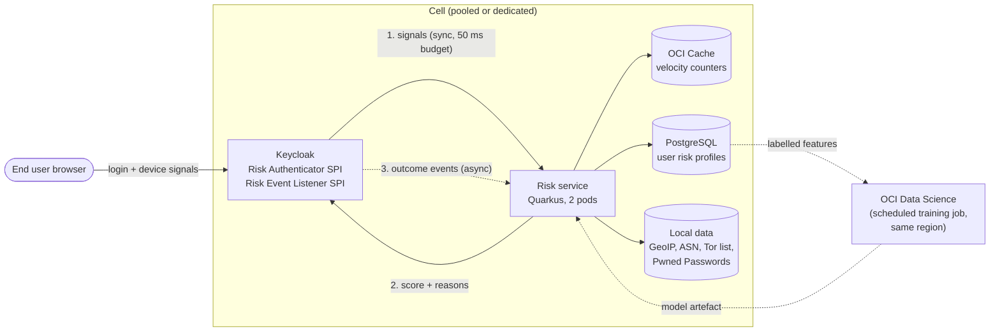
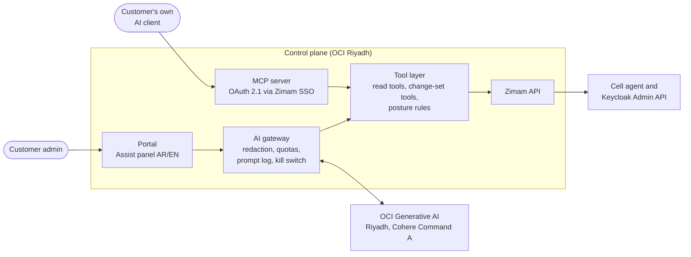

# Zimam (زمام) AI Strategy

| | |
|---|---|
| **Product** | Zimam Identity Cloud, powered by Keycloak |
| **Document type** | Product strategy and design: AI features, competitor AI analysis, costs |
| **Research date** | 8 October 2026 |
| **Status** | Draft v1, for internal planning |
| **Related** | [HLD](../architecture/hld.md), [Managed services and costs](../architecture/hld-managed-services-costs.md), [Security and compliance](../architecture/security-compliance.md), [KSA competitor analysis](../market/ksa-competitor-analysis.md) |

---

## 1. Executive summary

- **AI helps Zimam in four places.** (1) Inside the login path: risk-based authentication, and bot and fraud detection. (2) For customer admins: a copilot that configures and troubleshoots Keycloak in Arabic or English. (3) As a new market: identity and authorization for AI agents and MCP servers. (4) For our own small team: operations, support and engineering.
- **Competitors show three patterns** (section 3):
  - **Risk and fraud AI is standard at the top of the market but kept in expensive tiers.** It is Enterprise-only at Auth0, an add-on at Okta, needs Entra ID P2, and needs Cognito Plus [1][2][3][4]. None of the managed-Keycloak specialists offers it [5][6][7][8]. That gap is our opening.
  - **Admin copilots are becoming MCP servers.** Okta, Descope, Cloud-IAM, Skycloak and FusionAuth let the customer's own AI client manage the tenant [9][10][5][6][11]. Ping, WSO2 and Microsoft also build assistants into the product [12][13][14].
  - **Identity for AI agents is where the 2025–2026 action is.** Okta, Auth0, Microsoft, Ping, IBM, CyberArk, SailPoint, Descope, Stytch, WorkOS, Clerk, Frontegg and WSO2 all shipped something. Pricing ranges from included (Okta Agent SSO) to +50% of the plan (Auth0) [15][2][16][17][18][19].
- **Upstream Keycloak 26.x already provides most agent-identity building blocks for free:**
  - Supported: MCP authorization server guidance, Dynamic Client Registration, standard token exchange, CIBA, DPoP, PAR [20][21][22][23].
  - Experimental or preview: Client ID Metadata Documents (CIMD), resource indicators, delegation with `act`, Shared Signals [24][25][26].
- **No global vendor documents AI features hosted in KSA.** The only in-Kingdom risk engine we found is Oracle OCI IAM's Adaptive Security, which uses rules and no ML [27]. Saudi AI identity players (Elm, Mozn, uqudo) are **partners for eKYC and fraud, not competitors in CIAM** [28][29][30].
- **We can run AI fully in-Kingdom today.** OCI Generative AI runs in Riyadh (Cohere Command A on demand) but not in Jeddah. Open models (Llama, Qwen, ALLaM) can be self-hosted on OCI GPUs from about USD 1,460 a month per A10 [31][32][33]. Azure and AWS Saudi regions are not live yet (November and December 2026) [34][35].
- **Recommendation:**
  1. **MVP:** no AI in the login path. Ship an **admin MCP server**, which costs us no LLM spend and leaves residency with the customer's own AI client. Also ship an **AI theme generator** as a demo feature.
  2. **Phase 2:** **Zimam Protect** (risk-based authentication: rules, then ML, all CPU and in-cell) and **Zimam Assist** (an in-portal copilot on OCI Generative AI in Riyadh).
  3. **Phase 2–3:** **Zimam for AI Agents**, packaging Keycloak's MCP and token-exchange features with a portal UX, CIBA approvals and later a token vault.
- **Cost is small next to the price book.** Protect adds about **SAR 375 a month per cell** (CPU and cache, no GPU). Assist costs about **SAR 0.30 per request** on demand. A self-hosted GPU only pays off above about 18,000 requests a month (section 9).
- **Rule we never break:** an LLM never makes the allow or deny decision at login. Login decisions use deterministic rules and ML scoring that run inside the customer's cell.

---

## 2. Where AI fits in Zimam

| Area | What AI does | Who pays | AI type | Runs where |
|---|---|---|---|---|
| **1. Login path (Zimam Protect)** | Risk score per login: new device, impossible travel, Tor/VPN/hosting IP, velocity, credential stuffing, bots, breached passwords. Drives allow, step-up (OTP, passkey, Nafath) or block. | Business and Starter add-on; Enterprise included | Rules + classic ML (no LLM) | Inside each cell, CPU only |
| **2. Admin copilot (Zimam Assist)** | Natural language to Keycloak config with a reviewed diff. Security posture score with explanations. "Why did this user fail to log in?" Theme generator. | Included with quotas | LLM with tools | OCI Generative AI Riyadh, behind an AI gateway in the control plane |
| **2b. Admin MCP server** | Lets the customer's own AI client (Claude, ChatGPT, Copilot) call Zimam's API with the admin's permissions | Included | None on our side | Zimam API; the customer picks the LLM |
| **3. Identity for AI agents** | MCP authorization server, agent clients, token exchange on behalf of a user, CIBA human approval, agent audit | Agent Pack add-on | None (OAuth features); AI only in anomaly signals later | Keycloak in the cell |
| **4. Zimam operations** | Alert triage, runbooks, support-ticket drafts from our docs, coding help for SPIs and Terraform | Internal cost | LLM | Internal tools; no customer personal data |
| **Later: eKYC and fraud** | Liveness, deepfake and document checks; transaction fraud | Pass-through + margin | Vendor AI | Partners (Elm/Nafath, uqudo, Mozn) |
| **Later: IGA** | Access-review recommendations, role mining, outlier entitlements | IGA module | Classic ML | Inside the cell |

---

## 3. How competitors use AI, and what it costs

Prices are public list prices in USD unless stated, converted at USD 1 = SAR 3.75. "Not public" means the vendor sells through sales. Facts not confirmed on a primary page are marked *(unverified)*.

### 3.1 Global IAM and CIAM platforms

| Vendor | Risk, fraud, bots (login path) | Admin copilot | Identity for AI agents | Governance AI | AI cost |
|---|---|---|---|---|---|
| **Okta** | Identity Threat Protection (ITP) with Okta AI. Re-checks risk throughout a session, takes in signals from other tools over the Shared Signals Framework, and can end sessions or log users out of apps [36]. | Okta Managed MCP Server (Early Access). Admins manage users, policies and logs from their AI client, with least-privilege scopes and an audit trail [9]. | Agent SSO with Cross App Access (XAA), GA 24 Aug 2026. "Okta for AI Agents" finds shadow agents and gives each one a human owner [15]. | Governance Analyzer suggests approve or revoke in access reviews [37] | ITP and ISPM are add-ons to Essentials (USD 17 per user/month) or part of Professional (quote). Agent SSO is included in SSO. Okta for AI Agents is a separate SKU, price not public [1][15]. |
| **Auth0** | Bot Detection (supervised ML ensemble) [38][39]. Adaptive MFA scores new device, impossible travel and untrusted IP [40]. | – | Auth0 for AI Agents (GA): Token Vault, async authorization over CIBA, fine-grained authorization for RAG [16] | – | Bot Detection and Adaptive MFA are **Enterprise-only add-ons**, price not public. The AI Agents add-on is **+50% of the base plan**, e.g. B2C Professional at 10k MAU is USD 800/month [2]. |
| **Microsoft Entra** | ID Protection risk detections. Full detail needs P2 [41]. | Security Copilot in Entra: Conditional Access Optimization Agent (GA), Access Review Agent [14] | Entra Agent ID (GA): agent blueprints, Conditional Access and ID Protection for agents [17] | Access Review Agent [14] | P1 USD 7, P2 USD 10, Entra Suite USD 12 per user/month. Security Copilot USD 4 per provisioned Security Compute Unit (SCU) per hour. Agent 365 USD 15 per user/month [3][42][43]. |
| **Ping Identity** | PingOne Protect: ML risk predictors (bot behaviour biometrics through the Signals SDK, geovelocity, new device, adversary-in-the-middle, user behaviour model) [44] | PingOne AI Assistant in DaVinci: explains flows, finds misconfigurations, diagnoses failed runs [12] | Identity for AI (announced Nov 2025, GA reported Mar 2026 *(unverified)*): Agent IAM Core, Agent Gateway for MCP, agent detection [11][5] | – | Customers plans from USD 35k/year. Protect, AI Assistant and Identity for AI are not public [45]. |
| **IBM Verify** | Adaptive access risk engine with X-Force threat intelligence. Identity Protection (ITDR and ISPM) [7][8]. | watsonx assistant *(unverified)* | IBM Agent Identity, public preview 1 Sep 2026: registry, delegation, token exchange, human approval [20] | – | Usage-based per active user; AI features not public [6] |
| **CyberArk (Palo Alto Networks, "Idira")** | CORA AI threat investigation [21] | CORA AI policy suggestions [21] | Secure AI Agents, GA Dec 2025 [46][22] | – | Not public |
| **SailPoint** | – | Harbor Pilot agents [25] | Agent Identity Security; Agentic Fabric GA Aug 2026 *(unverified)* [26] | ML access recommendations, peer outliers, role discovery [47][24] | Not public |
| **Oracle OCI IAM** | Adaptive Security: risk level per user from sign-in history plus third-party risk providers. **Rules; no ML described** [27]. | – | – | – | **Included in all identity-domain types** [48]. External User about USD 0.016 per user/month [49]. |
| **AWS Cognito** | Plus tier: threat protection, adaptive authentication, compromised-credential detection [4] | – | – | – | Plus USD 0.020/MAU (no free tier) vs Essentials USD 0.015/MAU. At 10k MAU, Plus costs USD 200 (SAR 750) a month [4]. |
| **Google Identity Platform** | reCAPTCHA Enterprise scoring, SMS toll-fraud defence [50] | – | – | – | reCAPTCHA Premium USD 8 flat for 10k–100k assessments, then USD 1 per 1,000 [51] |
| **Transmit Security (Mosaic)** | AI fraud and account-takeover detection, detection of AI agents [52] | – | Ephemeral scoped agent tokens [52] | – | Not public |

### 3.2 Developer CIAM, managed Keycloak and open source

| Vendor | Risk, fraud, bots | Copilot or AI builder | Agent and MCP identity | AI cost |
|---|---|---|---|---|
| **Descope** | Built-in risk signals in every flow (Cloudflare bot flag, impossible travel, 0–1 risk score); Fingerprint, Forter and reCAPTCHA connectors [53] | Hosted MCP server for flows, themes, users and audit; read-only by default, time-limited write elevation [10] | Agentic Identity Hub: OAuth 2.1 for MCP, DCR, CIMD, per-tool scopes, token vault, token exchange [54] | Pro from USD 249/month and Growth from USD 799/month, each with agent quotas (e.g. Pro 5,000 monthly active consents); overage not public [55] |
| **Stytch** (Twilio, *unverified*) | ML device fingerprinting with ALLOW/CHALLENGE/BLOCK verdicts and reasons; detects AI browser agents (vendor claim) [56] | – | Connected Apps: a customer's app becomes an OAuth provider for MCP clients, with DCR [57] | Fingerprinting: 10,000 included, then USD 0.005 each; advanced fraud is Enterprise only [58] |
| **WorkOS** | Radar: fingerprinting on more than 20 traits; bots, brute force, impossible travel; tells AI agents from crawlers [59] | – | AuthKit as MCP authorization server, CIMD preferred, DCR fallback [60] | Radar: 1,000 checks free, then USD 100 per 50,000 checks [61] |
| **Clerk** | Turnstile "smart" CAPTCHA, ML fingerprinting, disposable-email blocking [62] | Docs MCP server and agent skills for coding assistants [63] | OAuth provider with CIMD and DCR, M2M tokens, Agent Tasks [63][64] | Bot protection on all plans incl. free; M2M tokens USD 0.001 per creation after the free quota [64] |
| **Frontegg** | Advanced fraud protection (Enterprise) [65] | – | AgentLink / Agen.co MCP gateway with human approval steps and field masking [66] | Not public |
| **FusionAuth** | Rules-based threat detection (impossible travel, rate limits); no ML [67] | Preview admin MCP server [68] | Guide to protect an MCP server; manual client registration; no RFC 8693 token exchange [68] | Threat detection is Enterprise only [69] |
| **WSO2 Identity Platform (Asgardeo) / Identity Server** | Sift risk score in conditional authentication; reCAPTCHA [70] | **LoginFlow AI** (flows from natural language), AI branding from a website URL, AI-assisted MCP setup [13][71] | **Agent ID** GA Oct 2025 in Asgardeo and open-source Identity Server 7.2; MCP authorization; `act` claim; CIBA for agents [18][72] | Free 15k MAU with 2,500 agent tokens; Growth from USD 25/month; fraud detection is an Enterprise add-on, price not public [19] |
| **Cloud-IAM** (managed Keycloak) | None | Beta MCP server with 19 control-plane tools, OAuth 2.1, off by default [5] | Guides only | Included; deployment tools need a paid plan [5] |
| **Skycloak** (managed Keycloak) | None | Admin MCP server ("included with every plan"; pricing table says "coming soon") [6] | MCP guides (DCR, CIMD, RFC 8707) | Included [6] |
| **Phase Two / Yookey** (managed Keycloak) | None | None | Phase Two: blog tutorial only [7] | – |
| **Keycloak open source** | No built-in adaptive authentication. Community `keycloak-adaptive-authn` extension: local risk evaluators, and sends hard cases to an external LLM (OpenAI, Claude, Gemini) after anonymising the data [73][74] | – | See section 3.4 | Free |

### 3.3 Saudi and GCC players

| Player | AI capability | Cost | KSA-hosted | Role for Zimam |
|---|---|---|---|---|
| **Elm: Nafath** | AI biometric verification and liveness checks [28] | Not public | Yes | Must-have login integration. It already does liveness, so Zimam doesn't need its own for Nafath logins. |
| **Elm: Yakeen, Thaki** | Yakeen matches data against government records (no AI described). Thaki is AI fraud detection for POS and insurance (marketing only) [75][76]. | Not public | Yes | Supplier for the identity-verification module |
| **Mozn (FOCAL)** | Fraud scoring, device risk, Arabic/Latin AML name matching, agentic AI for investigations; Al Rajhi Bank is a customer [29][77] | Not public | Riyadh company; on-premises option *(unverified)* | Partner for bank customers, or a future competitor to Protect in financial services |
| **uqudo** | Liveness, deepfake and image-injection detection, NFC ID chip reading, 1:N face search [30] | Not public | "In-country hosting options" in MENA; KSA not confirmed | Partner for eKYC onboarding |
| **Unifonic** | No AI fraud feature documented. SMS-pumping defence is geo-permissions plus customer-side rate limits [78]. | Not public | Saudi company | Zimam Protect should add **SMS-pumping detection** itself |
| **Oracle OCI IAM** | Rules-based Adaptive Security [27] | Included [48] | Yes (OCI Riyadh and Jeddah) | Only in-Kingdom risk engine found. Zimam must beat it with ML, explainability and Nafath step-up. |

### 3.4 What upstream Keycloak already gives us for agents and MCP

| Capability | Status (Keycloak 26.8, 1 Oct 2026) | Source |
|---|---|---|
| MCP authorization server (OAuth 2.1, RFC 8414 metadata, RFC 9207) | Supported for MCP spec 2025-03-26; newer spec revisions experimental | [20] |
| Dynamic Client Registration (RFC 7591) | Supported | [21] |
| Client ID Metadata Documents (CIMD) | Experimental (`--features=cimd`); Claude Code and VS Code documented as clients in 26.7 | [24][25] |
| Resource indicators (RFC 8707) | Experimental; works with CIMD in 26.8 | [26] |
| Standard token exchange (RFC 8693) | Supported and on by default since 26.2 | [22] |
| Delegation (`act` claim, `may_act` policy) | Preview in 26.8 | [26] |
| JWT Authorization Grant (RFC 7523), federated client auth incl. Kubernetes service accounts | Supported in 26.6 | [24] |
| CIBA (human approval on another device) | Supported and certified | [21] |
| DPoP, PAR, FAPI 2 | Supported | [21][23] |
| Shared Signals (CAEP, RISC), AuthZen, SPIFFE | Experimental or preview | [25][26] |
| Rich Authorization Requests (RFC 9396) | Not supported | [21] |

### 3.5 What this means for Zimam

1. **Risk-based login is a paid enterprise feature everywhere, and missing from managed Keycloak.** We can offer it at mid-market prices, run it in-Kingdom, and use Nafath as the step-up. No competitor has all three.
2. **An admin MCP server is cheap to build, and expected.** Okta, Descope, FusionAuth, Cloud-IAM and Skycloak already have one. It costs us nothing in LLM spend, and when a customer connects their own AI client, sending data to that LLM is the customer's decision, not a Zimam transfer under PDPL.
3. **An in-product copilot is a differentiator only if it is Arabic and in-Kingdom.** Ping's, Microsoft's and WSO2's assistants run outside KSA; Security Copilot processes prompts in the US, UK, EU or ANZ for non-EU tenants [79].
4. **WSO2 is the closest comparison.** It is open source, has AI flow generation and Agent ID, and sells through Saudi partners [18][19]. Zimam's answer: run in-Kingdom as a service (WSO2's SaaS is US/EU only, per the competitor analysis), with Nafath, Arabic and a managed SLA.
5. **For agent identity, Keycloak's experimental flags are the main risk.** CIMD, resource indicators and delegation are not yet "supported". We should sell agent features as **preview** on Business and keep them off Gov cells until upstream marks them supported.
6. **Price anchors:** Auth0 charges +50% of the plan for agents. Cognito Plus adds USD 0.005 per MAU over Essentials for threat protection. WorkOS Radar costs USD 2 per 1,000 checks. Okta includes Agent SSO in SSO. Our proposed prices are in section 9.3.

---

## 4. Zimam AI capability catalogue

| # | Capability | Tier | Phase | Build or buy | Effort (person-weeks, rough) |
|---|---|---|---|---|---|
| A1 | **Admin MCP server** over the Zimam API, scoped to the admin's tenant and roles | All paid | MVP+ | Build (Quarkus MCP extension) | 2–3 |
| A2 | **AI theme generator**: logo and brand colours to an Arabic/English Keycloak login theme | All | MVP+ | Build (LLM + template) | 2 |
| P1 | **Zimam Protect v1**: rules engine, signals, step-up policy, admin event reasons | Starter add-on, Business add-on, Enterprise included | Phase 2 | Build (Keycloak SPIs + risk service) | 6–8 |
| P2 | **Self-hosted bot challenge** (proof-of-work or self-hosted CAPTCHA, no third-party calls) | With Protect | Phase 2 | Use community extension, harden | 1–2 |
| P3 | **Breached-password check** against a local copy of the Pwned Passwords dataset | With Protect | Phase 2 | Build | 1 |
| P4 | **SMS-pumping protection** for OTP (velocity per prefix and country, conversion-rate alerts) | All | Phase 2 | Build | 1–2 |
| P5 | **Zimam Protect v2**: ML scoring (per-user baselines + gradient-boosted model per cell) | Same as P1 | Phase 3 | Build | 6 |
| C1 | **Zimam Assist (read-only)**: explain config, posture score, login troubleshooting from events | Included with quotas | Phase 2 | Build on OCI Generative AI | 4 |
| C2 | **Zimam Assist (change sets)**: natural language to config diff; admin approves | Included with quotas | Phase 2–3 | Build | 4 |
| G1 | **Agent Pack**: MCP-server registration wizard, CIMD/DCR policies, token-exchange templates, agent registry and audit view | Business add-on, Enterprise included | Phase 2–3 | Package Keycloak + build portal UX | 4–6 |
| G2 | **Human approval for agents** with CIBA to email, SMS or a Zimam approval page | With Agent Pack | Phase 3 | Configure + build authenticator UI | 2–3 |
| G3 | **Token vault** for agents' third-party OAuth tokens | With Agent Pack | Phase 3+ | Build | 6 |
| K1 | **eKYC with liveness** via uqudo or Nafath | Verification module | Phase 3 | Partner | 3 (integration) |
| O1 | **Ops AI**: alert summaries, runbook assistant, support drafts | Internal | Ongoing | Use (LLM tools) | 1–2 |

Total for Phase 2 (P1–P4, C1, A1, A2) is about 17–22 person-weeks, which is a realistic quarter for a 2–3 person team alongside running the service.

---

## 5. Design: Zimam Protect (risk-based authentication)

### 5.1 Principles

- **No LLM in the login path.** Decisions are deterministic or classic ML, explainable, and fast (p95 budget 50 ms).
- **Runs inside the cell.** Signals, profiles and models stay in the customer's cell. Dedicated Gov cells train only on their own data.
- **No third-party calls during login.** GeoIP, IP reputation, breached-password and bot challenges all use local data.
- **Customer controls the policy.** Thresholds and actions are per realm. Zimam ships safe defaults.
- **Every decision has reasons** in the admin event log, to meet SDAIA's transparency principle [80].

### 5.2 Architecture

1. The **Risk Authenticator** sits in the browser flow after username and password. It sends the IP, a device fingerprint (from the login theme's JavaScript plus a device cookie), the user, the client and the time.
2. The **risk service** returns a 0–100 score and reasons, for example `new_device`, `geo_velocity SA→NL in 20 min`, `hosting_asn`, `ip_failed_logins_1h=48`.
3. The flow branches on the realm policy:

| Score | Default action | Notes |
|---|---|---|
| 0–39 | Allow | |
| 40–69 | Step up: passkey, OTP or **Nafath** | Nafath step-up is our differentiator for Saudi users |
| 70–89 | Bot challenge, then step up | Proof-of-work or a self-hosted CAPTCHA |
| 90–100 | Block and notify the user and admin | Optional: lock the account temporarily |
| Risk service timeout | Treat as 40–69 (step up if the user has MFA, else allow and log) | Configurable: fail open or fail closed |

4. The **Risk Event Listener** sends outcomes (login success, MFA failure, password reset, admin-confirmed fraud) back as labels and to update profiles.

### 5.3 Signals

| Signal | Source | Version |
|---|---|---|
| New device or browser for this user | Device cookie + fingerprint hash | v1 |
| Impossible travel and country change | Local GeoIP database | v1 |
| Tor exit node, hosting/VPN ASN | Local lists, refreshed daily | v1 |
| Failed-login velocity per user, IP and /24 | OCI Cache counters | v1 |
| Credential stuffing (many usernames per IP or device) | OCI Cache counters | v1 |
| Breached password | Local Pwned Passwords hash set (k-anonymity API not needed) | v1 |
| Unusual hour or client for this user | Per-user baseline in PostgreSQL | v1 |
| OTP SMS pumping (destination prefix velocity, low conversion) | OTP events | v1 |
| Behavioural bot signals (typing cadence, pointer movement) | Login theme JavaScript | v2 |
| ML score from all features | Gradient-boosted model per cell | v2 |
| Signals from customer tools (CAEP/RISC over Shared Signals) | Keycloak SSF (experimental upstream) | v3 |

### 5.4 Data, privacy and tenancy

- Profiles hold hashed device IDs, coarse location (city or country), ASN and time buckets. They hold no raw biometrics.
- Retention is 90 days for login events used in scoring, and per-tenant configurable for audit.
- In pooled cells, profiles are keyed by realm. A single global model per cell uses only non-identifying features (velocity ratios, ASN class, geo distance). Gov dedicated cells get their own model.
- Customers can export decisions and reasons through the existing SIEM export add-on.
- PDPL: processing is for security, the data never leaves the cell, and the purpose is stated in the DPA.

### 5.5 Running cost

| Item | Sizing | USD/month |
|---|---|---|
| Risk service | 2 pods, each E5 1 OCPU + 4 GB | 56 |
| OCI Cache | 2 GB | 28 |
| Block volume for local datasets | 50 GB | 2 |
| Training jobs (OCI Data Science, CPU) | A few hours a week | ~10 |
| **Total per cell** | | **~96 (about SAR 360–375)** |

This uses the unit prices in [managed services and costs §6.1](../architecture/hld-managed-services-costs.md#61-key-unit-prices). A pooled cell holds up to 200 Starter realms and 40 Business instances, so the per-tenant cost is a few riyals. The Jeddah DR copy runs warm at about half that.

---

## 6. Design: Zimam Assist (admin copilot) and the admin MCP server

### 6.1 Two ways in

| | **Admin MCP server** (A1) | **Zimam Assist in the portal** (C1, C2) |
|---|---|---|
| Who brings the LLM | The customer (Claude, ChatGPT, Copilot, a local model) | Zimam (OCI Generative AI, Riyadh) |
| Data residency | Customer's choice and responsibility | Stays in KSA |
| Our LLM cost | None | About SAR 0.30 per request (section 9.2) |
| Good for | Developers and DevOps teams | Admins who want Arabic, in-Kingdom help without setup; Gov (when enabled) |

Both call the same **tool layer** on the Zimam API, so permissions, audit and guardrails are written once.

### 6.2 Architecture

### 6.3 What it can do

- **Explain:** "What does this realm's browser flow do?" "Why can't my SPA get a refresh token?"
- **Posture score:** deterministic rules (admin MFA off, long token lifetimes, wildcard redirect URIs, implicit flow enabled, no brute-force protection, weak password policy, unused clients). The LLM only explains and suggests fixes.
- **Troubleshoot:** "Why did user X fail to log in yesterday at 10:00?" It reads that user's events, with personal data minimised before it reaches the LLM.
- **Change sets (C2):** "Add a React SPA client with PKCE, Google and Nafath." It produces a partial-import JSON or a Terraform snippet, **shows a diff, and applies only after the admin approves**. The change is applied under the admin's identity and recorded in the audit log.
- **Theme generator (A2):** logo and brand colours to a Keycloak login theme in Arabic (RTL) and English, previewed before publishing.

### 6.4 Guardrails

| Risk | Control |
|---|---|
| Wrong or harmful config change | No autonomous writes. Every change is a diff the admin approves, and it can be rolled back from the audit log. |
| Leaking secrets | Client secrets, keys and credentials are never sent to the LLM; tools return masked values |
| Personal data in prompts | The gateway redacts or pseudonymises emails, Saudi national and Iqama IDs (10 digits starting 1 or 2), +966 phone numbers and IPs before the LLM call |
| Prompt injection from tenant data (user attributes, client descriptions) | Tool output is marked as untrusted data. Write tools need human approval. Tools are scoped to the admin's own realm. |
| Cross-tenant access | Tools use the admin's own token and the Zimam API's tenant scoping; the LLM never holds a platform credential |
| Cost runaway | Per-tenant monthly request quotas and a global kill switch |
| Gov customers | Off by default. SDAIA's generative AI guidance for government says not to enter data classified "restricted" or higher *(unverified, from search excerpts)* [81], so Gov tenants get config-only tools and no event troubleshooting, or a self-hosted model in their dedicated cell |
| DR | Assist depends on OCI Generative AI in Riyadh, which is not in Jeddah [31]. During a Riyadh outage Assist is unavailable; logins are not affected. This is stated in the SLA. |

### 6.5 Model choice

- **Default:** Cohere Command A, on demand in OCI Generative AI Riyadh [31][32]. Cohere lists Arabic among Command A's supported languages; we must validate Arabic quality for Keycloak tasks in a bake-off.
- **Alternatives to test in the same bake-off:**
  - ALLaM 7B (Apache-2.0, Arabic-first) or Qwen, self-hosted on one OCI A10 [33][82].
  - Llama 3.3 70B or gpt-oss-120b on an OCI dedicated AI cluster in Riyadh, if volume grows [32].
- **Later:** Azure Saudi Arabia East (November 2026) and AWS Bedrock in KSA (December 2026, ALLaM planned) can be added once their models are confirmed in-region [34][35].

---

## 7. Design: Zimam for AI Agents

### 7.1 Offer

"Let your customers' AI agents and MCP servers authenticate users and act on their behalf, with every token issued in the Kingdom."

### 7.2 What we package

| Customer need | Keycloak feature | What Zimam adds |
|---|---|---|
| Protect my MCP server | MCP authorization server, DCR, CIMD, resource indicators [20][24][26] | Wizard: "Register MCP server". Sets audience, scopes per tool, CIMD/DCR allow-list policy. |
| Agent acts for a signed-in user | Standard token exchange, delegation with `act` [22][26] | Templates for down-scoped, short-lived tokens; agent clients labelled in the portal |
| Human approves sensitive actions | CIBA [21] | Approval page and notifications (email, SMS via Unifonic, later Nafath-style push) |
| Bind tokens to the agent | DPoP [23] | On by default for agent clients |
| Know what agents did | Admin and user events | Agent registry and audit view, SIEM export |
| Store third-party tokens for agents | Not in Keycloak | Token vault (Phase 3+), with secrets in OCI Vault |
| Detect rogue agents | Shared Signals (experimental) [25] | Later: agent anomaly signals from Zimam Protect |

### 7.3 Conditions

- Features marked experimental upstream (CIMD, resource indicators, delegation) are sold as **preview**, not covered by the SLA, and not enabled on Gov cells until Keycloak marks them supported.
- **Brand risk:** zimam.dev is an open-source AI-agent authorization project using the same name (see the [competitor analysis](../market/ksa-competitor-analysis.md) and the brand notes). Launching an agent-authorization product under "Zimam" increases the chance of confusion. Settle the trademark search before marketing this offer.

---

## 8. Hosting AI in the Kingdom

| Option | In KSA today? | Models | List price (USD) | Use it for |
|---|---|---|---|---|
| **OCI Generative AI, Riyadh** | **Yes, Riyadh only** (since Aug 2025); **not Jeddah** [31] | On demand: Cohere Command A, Embed 4, Rerank 4.0 Fast. Dedicated cluster only: Llama 4, Llama 3.3 70B, gpt-oss-120b/20b, Command A Reasoning and Vision [32] | "Large Cohere" USD 0.0156 per 10,000 characters (that this applies to Command A is *unverified*). Dedicated clusters from about USD 6.50–24 per hour on older units [49] | Zimam Assist default |
| **OCI Data Science** | Yes, all regions [83] | Any model you bring | Underlying compute only | Protect model training; self-hosted models |
| **OCI AI Anomaly Detection** | **Retired March 2025** [84] | – | – | Do not use; use the Data Science anomaly operator |
| **Self-hosted open model on an OCI GPU** | Yes, if the shape is offered in the region (check in our tenancy) [85] | ALLaM 7B, Qwen, Llama 8B | A10 USD 2.00/hour (**about USD 1,460 a month**), L40S USD 3.50/hour (about USD 2,555 a month), H100 USD 10.00/hour [49] | Gov dedicated cells; Jeddah DR; high volume |
| **HUMAIN (ALLaM, HUMAIN ONE)** | Consumer chat yes; business API pricing not public [33][86] | ALLaM 7B open weights; larger ALLaM via partners *(unverified)* | Not public | Watch; possible future provider |
| **Google Vertex AI, Dammam (via CNTXT)** | Region live, but Google says endpoints "don't guarantee data residency or in-region ML processing" [87] | Gemini, Claude, Llama, Qwen (Middle East group) | Not checked | Not suitable for in-Kingdom guarantees |
| **Azure OpenAI / AI Foundry, Saudi Arabia East** | No; region GA November 2026, model list not announced [34] | – | – | Re-check after launch |
| **AWS Bedrock, Saudi region** | No; target December 2026, ALLaM planned [35] | – | – | Re-check after launch |
| **Core42 / G42 (UAE)** | **No, UAE-hosted** | gpt-oss and other open models | gpt-oss-120b about USD 0.25–0.40 in / 0.69–0.95 out per million tokens [88] | Only with redacted, non-personal data; counts as a cross-border transfer |

### 8.1 Regulation that shapes the design

- **PDPL transfer regulation (v2.0, Aug 2024):** sending identity logs to an LLM outside KSA is a transfer. It needs an adequate destination or safeguards (SCCs, binding common rules, certification), a prior risk assessment, and data minimisation [89]. Keeping inference in Riyadh avoids all of this.
- **NCA CCC-2:2024** removed the "serve from within the Kingdom" controls. Data localisation is now governed by NDMO at SDAIA, which entities must consult [90]. Government data stays in-Kingdom under CCRF (see the competitor analysis).
- **NCA AI Cybersecurity Guidelines:** a draft consulted on from July to August 2026, covering generative and agentic AI. The final version was not found. We should map Assist and the Agent Pack to it once it is published [91].
- **SDAIA AI Ethics Principles:** fairness, privacy, reliability, transparency, accountability, humanity, social benefit [80]. Protect's reason codes and Assist's approval step are our evidence.
- **SDAIA Generative AI Guidelines for government:** use only "public" data and no generative AI for critical decisions about individuals *(unverified, from search excerpts)* [81]. This is why Gov Assist is off by default and why no LLM decides logins.

---

## 9. Cost and pricing

### 9.1 What it costs Zimam

| Feature | Cost driver | Estimate |
|---|---|---|
| Admin MCP server | Runs in the existing Zimam API | ~0 |
| Theme generator | About 5 LLM calls per theme | < SAR 2 per theme |
| Zimam Protect | Risk service, cache, data, training (section 5.5) | ~SAR 375 per cell per month, plus ~SAR 180 for the Jeddah warm copy |
| Zimam Assist | LLM tokens on demand | ~SAR 0.30 per request (below) |
| Agent Pack | Keycloak features; token vault later in OCI Vault and PostgreSQL | ~0 infra; engineering cost only |
| Ops AI | Developer and support AI tools | Tool subscriptions per seat; no customer data |

### 9.2 Zimam Assist: on demand vs self-hosted

Assumed average request: 3 LLM turns × (15,000 characters in + 1,000 out) = 48,000 characters.

| Option | Cost per request | Monthly cost | Break-even |
|---|---|---|---|
| OCI Generative AI on demand, Command A at USD 0.0156 per 10k characters | ~USD 0.075 (**~SAR 0.30**) | Scales with use: 1,000 requests ≈ SAR 280 | – |
| Self-hosted ALLaM/Qwen 7B on one A10, Riyadh, 24×7 | Fixed | USD 1,460 (**~SAR 5,475**), Jeddah copy doubles it | ~18,000 requests a month |

**Decision:** start on demand. Move to a self-hosted model or a dedicated cluster only when volume passes about 18,000 requests a month, or when a Gov customer needs Assist in their own cell.

### 9.3 Proposed prices (SAR per month, excluding VAT)

These follow the [price book](../architecture/hld-managed-services-costs.md#82-price-book-sar-per-month-excluding-vat) and are proposals to validate with customers.

| Product | Starter | Business S / M / L | Enterprise / Gov | Market anchor |
|---|---|---|---|---|
| **Zimam Protect** (risk-based auth, bot challenge, breached passwords) | +SAR 0.02 per MAU band (5k = 100, 10k = 200, 25k = 500, 50k = 1,000) | +500 / 1,000 / 2,000 | Included | Cognito Plus adds USD 0.005/MAU (~SAR 0.019) over Essentials [4]; Auth0 and Okta only on Enterprise or add-on, not public [1][2]; OCI IAM includes rules-based risk [48] |
| **Zimam Assist** (in-portal copilot) | 50 requests included | 300 included | 1,000 included (Gov: opt-in) | Security Copilot USD 4 per SCU-hour [42]; Ping and WSO2 do not publish prices |
| Extra Assist requests | SAR 50 per 100 requests | Same | Same | Our cost ~SAR 30 per 100 |
| **Admin MCP server** | Included | Included | Included | Included at Okta (EA), Cloud-IAM, Skycloak [9][5][6] |
| **AI theme generator** | Included | Included | Included | WSO2 AI branding [13] |
| **Agent Pack** (MCP registration, token-exchange templates, CIBA approvals, agent audit) | – | +750 (preview) | Included once upstream features are supported | Auth0 +50% of plan [2]; Okta Agent SSO included [15]; Descope agent quotas from USD 249/month [55] |

Margins: Protect costs a pooled cell about SAR 375 a month in total, so two Business S add-ons cover the whole cell. At full Assist quota a Business tenant costs about SAR 90 a month, which is inside the 74% Business margin.

---

## 10. Roadmap

| Phase | When | AI deliverables | Exit criteria |
|---|---|---|---|
| **MVP** | Next 6 months | No AI in the login path. Admin MCP server (A1), AI theme generator (A2). Collect login events in the format Protect will need. | MCP server passes tenant-scoping tests; themes pass RTL review |
| **Phase 2** | 6–12 months | Protect v1 (P1–P4), Assist read-only (C1), Assist change sets (C2), Agent Pack preview (G1) | Protect p95 under 50 ms at pooled-cell load; false step-up rate under 2% in pilot; Arabic Assist bake-off passed |
| **Phase 3** | 12–24 months | Protect v2 ML (P5), CIBA approvals (G2), token vault (G3), eKYC partner (K1), Shared Signals export | ML model beats rules on precision at the same recall in a pilot tenant |

---

## 11. Risks and open questions

| # | Item | Mitigation or next step |
|---|---|---|
| 1 | Command A's Arabic quality for Keycloak tasks is unproven | Bake-off: Command A vs ALLaM 7B vs Qwen on 50 real admin tasks in Arabic and English |
| 2 | Which OCI price SKU covers Command A on demand in Riyadh is unverified | Confirm with Oracle or run a metered pilot |
| 3 | Which GPU shapes are available in Riyadh and Jeddah is not public | Check service limits and ListShapes in our tenancy; request GPU quota early |
| 4 | Keycloak agent features (CIMD, resource indicators, delegation) are experimental or preview | Sell as preview; track Keycloak releases; contribute fixes upstream |
| 5 | False positives in Protect lock out real users | Start each tenant in monitor-only mode for 14 days; show reasons; one-click admin override |
| 6 | Prompt injection through tenant data reaches write tools | Human approval for all writes; tool allow-lists; red-team tests before GA |
| 7 | zimam.dev in the same agent-authorization category | Finish the SAIP trademark search before launching the Agent Pack |
| 8 | NCA AI Cybersecurity Guidelines are still a draft | Map controls when the final version is published |
| 9 | Small team: AI work competes with running the service | Ship MCP server and themes first (low effort); do Protect before Assist change sets |
| 10 | Mozn or Elm could move into CIAM risk scoring | Partner rather than compete in banking fraud; keep Protect focused on login and account takeover |

---

## 12. Sources

1. Okta pricing. https://www.okta.com/pricing/
2. Auth0 pricing. https://auth0.com/pricing
3. Microsoft Entra pricing. https://www.microsoft.com/en-us/security/business/microsoft-entra-pricing
4. Amazon Cognito pricing. https://aws.amazon.com/cognito/pricing/
5. Cloud-IAM MCP and pricing. https://documentation.cloud-iam.com/how-to-guides/mcp.html ; https://www.cloud-iam.com/pricing
6. Skycloak MCP and pricing. https://skycloak.io/mcp/ ; https://skycloak.io/pricing/
7. Phase Two MCP blog and pricing. https://phasetwo.io/blog/instant-mcp-authorization-keycloak/ ; https://phasetwo.io/pricing
8. Yookey / keycloak-saas.com. https://keycloak-saas.com
9. Okta MCP server. https://developer.okta.com/docs/concepts/mcp-server/
10. Descope MCP server. https://docs.descope.com/mcp/mcp-server
11. Ping press release, Identity for AI (6 Nov 2025). https://press.pingidentity.com/2025-11-06-Ping-Identity-Launches-Identity-for-AI-Solution-to-Power-Innovation-and-Trust-in-the-Agent-Economy
12. PingOne DaVinci AI Assistant. https://docs.pingidentity.com/davinci/flows/davinci_using_the_ai_assistant.html
13. WSO2, AI-powered capabilities in Asgardeo. https://wso2.com/library/blogs/announcing-new-ai-powered-capabilities-in-asgardeo/
14. Microsoft Entra blog, Security Copilot agents. https://techcommunity.microsoft.com/blog/microsoft-entra-blog/-/4429001
15. Okta press release, Agent SSO (24 Aug 2026). https://okta.com/newsroom/press-releases/okta-brings-first-class-identity-to-ai-agents-with-agent-sso/
16. Auth0 for AI Agents GA. https://auth0.com/blog/auth0-for-ai-agents-generally-available/
17. Entra Agent ID, what's new. https://learn.microsoft.com/en-za/entra/agent-id/whats-new-agent-id
18. WSO2 news, AI and B2B capabilities incl. Agent ID. https://wso2.com/about/news/wso2-expands-ai-and-b2b-capabilities-across-iam-product-family/
19. WSO2 Asgardeo pricing. https://wso2.com/asgardeo/pricing/
20. Keycloak, MCP authorization server guide. https://www.keycloak.org/securing-apps/mcp-authz-server
21. Keycloak supported specifications. https://www.keycloak.org/securing-apps/specifications
22. Keycloak, standard token exchange in 26.2 (May 2025). https://www.keycloak.org/2025/05/standard-token-exchange-kc-26-2
23. Keycloak 26.4.0 release (Sep 2025). https://www.keycloak.org/2025/09/keycloak-2640-released
24. Keycloak 26.6.0 release (Apr 2026). https://www.keycloak.org/2026/04/keycloak-2660-released
25. Keycloak 26.7.0 release (Jul 2026). https://www.keycloak.org/2026/07/keycloak-2670-released
26. Keycloak 26.8.0 release (Oct 2026). https://www.keycloak.org/2026/10/keycloak-2680-released
27. OCI IAM Adaptive Security. https://docs.oracle.com/en-us/iaas/Content/Identity/adaptivesecurity/understand-adaptive-security.htm
28. OECD OPSI, Nafath case study (2024) *(secondary)*. https://oecd-opsi.org/wp-content/uploads/2024/01/Nafath-App-1-2024-1.pdf
29. Mozn, AI anti-fraud product. https://www.mozn.ai/blog/mozn-announces-new-ai-powered-anti-fraud-product
30. uqudo. https://uqudo.com
31. OCI Generative AI regions; Riyadh release note. https://docs.oracle.com/en-us/iaas/Content/generative-ai/regions.htm ; https://docs.oracle.com/iaas/releasenotes/generative-ai/new-region-riyadh.htm
32. OCI Generative AI model endpoints by region. https://docs.oracle.com/en-us/iaas/Content/generative-ai/model-endpoint-regions.htm
33. ALLaM 7B Instruct on Hugging Face. https://huggingface.co/ALLaM-AI/ALLaM-7B-Instruct-preview
34. Microsoft, Saudi Arabia East region (31 Aug 2026). https://news.microsoft.com/source/emea/?p=267697
35. Amazon, AWS and HUMAIN investment in Saudi Arabia. https://aboutamazon.com/news/company-news/amazon-aws-humain-ai-investment-in-saudi-arabia
36. Okta Identity Threat Protection overview. https://help.okta.com/oie/en-us/content/topics/itp/overview.htm
37. Okta Governance Analyzer. https://help.okta.com/oie/en-us/Content/Topics/identity-governance/governance-analyzer/governance-analyzer.htm
38. Auth0 Bot Detection. https://auth0.com/docs/secure/attack-protection/bot-detection
39. Okta model card for Auth0 Bot Detection (30 Sep 2025). https://www.okta.com/content/dam/okta---digital/en_us/legal/trustandcompliance/okta-model-card-for-auth0-bot-detection-09-30-25.pdf
40. Auth0 Adaptive MFA. https://auth0.com/docs/secure/multi-factor-authentication/adaptive-mfa/adaptive-mfa-log-events
41. Entra ID Protection risks. https://learn.microsoft.com/en-us/entra/id-protection/concept-identity-protection-risks
42. Microsoft Security Copilot pricing. https://www.microsoft.com/en-us/security/pricing/microsoft-security-copilot/
43. Microsoft Agent 365. https://www.microsoft.com/en-us/microsoft-agent-365
44. PingOne Protect risk predictors. https://docs.pingidentity.com/pingone/threat_protection_using_pingone_protect/p1_protect_risk_predictors.html
45. Ping Identity pricing. https://www.pingidentity.com/en/platform/pricing.html
46. Keycloak features. https://www.keycloak.org/server/features
47. Keycloak 26.5.0 release (Jan 2026). https://www.keycloak.org/2026/01/keycloak-2650-released
48. OCI IAM identity domain types. https://docs.oracle.com/en-us/iaas/Content/Identity/sku/overview.htm
49. Oracle public price list API (lastUpdated 1 Oct 2026). https://apexapps.oracle.com/pls/apex/cetools/api/v1/products/?currencyCode=USD
50. Google Identity Platform with reCAPTCHA Enterprise. https://docs.cloud.google.com/identity-platform/docs/recaptcha-enterprise
51. reCAPTCHA tiers. https://docs.cloud.google.com/recaptcha/docs/compare-tiers
52. Transmit Security, Mosaic with Google Cloud AI (8 Sep 2025). https://transmitsecurity.com/blog/mosaic-by-transmit-security-built-with-google-cloud-ai-to-redefine-identity-and-fraud-prevention-in-the-era-of-consumer-ai-agents
53. Descope fingerprinting and risk signals. https://docs.descope.com/fingerprinting
54. Descope Agentic Identity Hub. https://docs.descope.com/agentic-identity-hub
55. Descope pricing and agent pricing update. https://www.descope.com/pricing ; https://www.descope.com/blog/post/m2m-agentic-identity-pricing-update
56. Stytch device fingerprinting and fraud. https://stytch.com/docs/fraud-risk/device-fingerprinting/overview ; https://stytch.com/fraud
57. Stytch Connected Apps for MCP. https://stytch.com/docs/connected-apps/guides/mcp-auth-overview
58. Stytch pricing. https://stytch.com/pricing
59. WorkOS Radar. https://workos.com/docs/authkit/radar
60. WorkOS AuthKit MCP. https://workos.com/docs/authkit/mcp
61. WorkOS pricing. https://workos.com/pricing.md
62. Clerk bot sign-up protection. https://clerk.com/docs/nextjs/guides/development/custom-flows/authentication/bot-sign-up-protection
63. Clerk AI guides; CIMD changelog (6 Aug 2026). https://clerk.com/docs/guides/ai/overview ; https://clerk.com/changelog/2026-08-06-client-id-metadata-documents
64. Clerk pricing. https://clerk.com/pricing
65. Frontegg pricing. https://frontegg.com/pricing
66. Frontegg AgentLink approval flows; Agen.co. https://developers.frontegg.com/agent-link/policies/approval-flows ; https://agen.co/platform
67. FusionAuth advanced threat detection. https://fusionauth.io/docs/operate/secure/advanced-threat-detection
68. FusionAuth MCP server and MCP access control. https://fusionauth.io/blog/fusionauth-mcp-server ; https://fusionauth.io/docs/extend/examples/controlling-access-mcp-server
69. FusionAuth pricing. https://fusionauth.io/pricing
70. WSO2 Sift fraud detection. https://wso2.com/asgardeo/docs/guides/account-configurations/login-security/sift-fraud-detection/
71. WSO2 AI login flow generation. https://wso2.com/asgardeo/changelog/ai-powered-login-flow-generation/
72. WSO2 agent authentication; CIBA for AI agents. https://wso2.com/identity-platform/docs/guides/agentic-ai/ai-agents/agent-authentication/ ; https://wso2.com/asgardeo/docs/tutorials/ciba-for-ai-agents/
73. Keycloak extensions list. https://www.keycloak.org/extensions
74. keycloak-adaptive-authn (Apache-2.0). https://github.com/mabartos/keycloak-adaptive-authn
75. Elm, Yakeen product sheet. https://elm.sa/ar/our-business/digital-products/Documents/En/Yakeen%20EN.pdf
76. Elm at GITEX Global 2024. https://elm.sa/en/elm-live/news/Pages/Elm-showcases-suite-of-key-digital-products-and-services-at-GITEX-Global-2024.aspx
77. Al Rajhi Bank partners with Mozn *(secondary)*. https://www.gulfbase.com/news/alrajhi-bank-partners-with-mozn-to-harness-ai-in-the-fight-against-fraud/212377
78. Unifonic, SMS fraud. https://docs.unifonic.com/articles/products-documentation/no-sms-fraud/
79. Security Copilot data processing locations. https://learn.microsoft.com/he-il/copilot/security/auto-provisioning-security-copilot
80. SDAIA AI Ethics Principles. https://sdaia.gov.sa/en/SDAIA/about/Documents/ai-principles.pdf
81. SDAIA Generative AI Guidelines for Government. https://sdaia.gov.sa/en/SDAIA/about/Files/GenAIGuidelinesForGovernmentENCompressed.pdf
82. OCI compute shapes. https://docs.oracle.com/en-us/iaas/Content/Compute/References/computeshapes.htm
83. OCI Data Science overview. https://docs.oracle.com/en-us/iaas/data-science/using/overview.htm
84. OCI AI Anomaly Detection retirement note. https://docs.cloud.oracle.com/iaas/releasenotes/changes/b11b7735-87fa-4d4a-a7ac-d72b95418e86/
85. Oracle, Zoom uses OCI GPUs in Saudi Arabia (9 Feb 2025). https://www.oracle.com/news/announcement/zoom-uses-oracle-cloud-infrastructure-to-power-its-ai-first-work-platform-in-saudi-arabia-2025-02-09/
86. Microsoft and HUMAIN at LEAP 2026 *(secondary)*. https://www.zawya.com/en/press-release/companies-news/microsoft-and-humain-expand-strategic-collaboration-at-leap-2026-with-new-enterprise-ai-offering-and-ai-pc-473520
87. Google Vertex AI locations and data residency; Dammam access. https://docs.cloud.google.com/vertex-ai/generative-ai/docs/learn/locations ; https://docs.cloud.google.com/vertex-ai/generative-ai/docs/learn/data-residency ; https://docs.cloud.google.com/docs/dammam-region-access
88. Core42 AI Cloud, gpt-oss. https://aicloud.core42.ai/gpt-oss
89. SDAIA, Regulation on Personal Data Transfer outside the Kingdom (v2.0, Aug 2024). https://sdaia.gov.sa/Documents/RegulationonPersonalDataEN.pdf
90. NCA CCC-2:2024, Annex D. https://cdn.nca.gov.sa/api/files/public/upload/6d5408a3-d8e6-4e96-963b-2c7198e5b7c2_CCC-2-2024-EN-.pdf
91. NCA, AI Cybersecurity Guidelines consultation. https://nca.gov.sa/en/news/ai-cybersecurity-guidelines/
